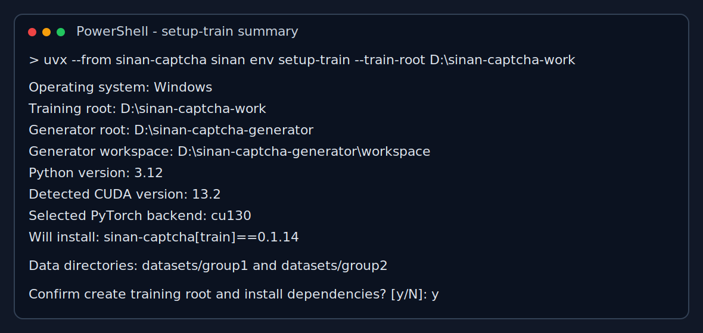
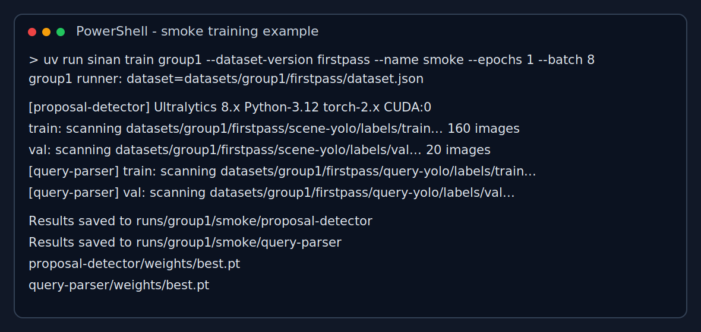

# Windows 快速开始

- 文档状态：生效
- 当前阶段：IMPLEMENTATION
- 目标读者：第一次在 Windows 训练机上启动训练的人
- 负责人：Codex
- 最近更新：2026-04-04

## 0. 这页解决什么问题

这页只解决一件事：

- 你已经有现成训练数据集，想在一台 Windows + NVIDIA 电脑上尽快把训练跑起来

如果你还没有训练数据，先跳到：

- [用生成器准备训练数据](./prepare-training-data-with-generator.md)

## 1. 你手里至少要有这些东西

### 1.1 机器条件

- Windows
- NVIDIA 显卡
- 已安装显卡驱动
- 能访问互联网

### 1.2 文件条件

至少满足下面两种情况之一：

- 已经拿到 `group1` 的 YOLO 数据集目录
- 已经拿到 `group2` 的 paired dataset 目录

`group1` 数据集目录最少要包含：

- `dataset.yaml`
- `images/`
- `labels/`

`group2` 数据集目录最少要包含：

- `dataset.json`
- `master/`
- `tile/`
- `splits/`

## 2. 你将得到什么

跑完这页后，你应该能得到：

- 一个独立训练目录：`D:\sinan-captcha-work`
- 至少一个专项的冒烟训练结果
- 训练输出目录下的 `weights\best.pt` 或至少能正常启动训练过程

如果你的机器没有 `D:` 盘，把文中的 `D:\` 统一替换成你自己的实际盘符即可。

## 3. 最短操作路径

### 3.1 检查显卡和驱动

打开 PowerShell：

```powershell
nvidia-smi
```

看到下面 4 类信息就继续：

- 显卡型号
- 驱动版本
- 显存
- `CUDA Version`

如果这一步就失败，先读：

- [如何确认 Windows 电脑上的 CUDA 版本](./how-to-check-cuda-version.md)

### 3.2 安装 `uv`

```powershell
winget install --id=astral-sh.uv -e
uv --version
```

### 3.3 创建训练目录

```powershell
Set-Location D:\
uvx --from sinan-captcha sinan env setup-train `
  --train-root D:\sinan-captcha-work `
  --generator-root D:\sinan-captcha-generator
```

你会看到中文摘要，确认后它会自动：

- 创建训练目录
- 生成训练目录自己的 `pyproject.toml`
- 生成训练目录自己的 `.python-version`
- 安装训练环境

这一步不要求你先在本机克隆源码仓库。`uvx --from sinan-captcha ...` 会直接从 PyPI 拉取当前 CLI 再执行。

终端看到的摘要大致会像这样：



### 3.3.1 如果训练机现在还是 `0.1.1`，怎么升级

如果你之前已经用 `0.1.1` 创建过训练目录，不需要删掉 `D:\sinan-captcha-work` 重来。直接用新版 CLI 再执行一次 `setup-train` 即可：

```powershell
uvx --from "sinan-captcha==0.1.3" sinan env setup-train `
  --train-root D:\sinan-captcha-work `
  --generator-root D:\sinan-captcha-generator `
  --yes
```

这条命令会做 3 件事：

- 用 `0.1.3` 的 CLI 重新写入训练目录里的 `pyproject.toml`
- 重新执行一次 `uv sync`，把训练环境升级到当前版本
- 保留原有 `datasets\`、`runs\`、`reports\`，不会删除你的训练数据和训练结果

如果你不是从 PyPI 路线安装，而是从交付包里的 wheel 启动训练目录，把 `--from` 换成新的 wheel 文件路径即可。对应示例见：

- [使用交付包在 Windows 训练机上安装](./windows-bundle-install.md)

### 3.4 把数据集拷进去

推荐放法：

- `D:\sinan-captcha-work\datasets\group1\firstpass\yolo`
- `D:\sinan-captcha-work\datasets\group2\firstpass`

如果你只有一个专项，就只放一个。

如果你拿到的是旧版数据集，不要继续硬跑：

- `group1`：如果 `dataset.yaml` 里还是别台机器的绝对路径，或者还带着 `path: .`，请重新导出
- `group2`：如果目录里还是旧版训练目录结构，而不是 `dataset.json + master/tile/splits`，请重新导出

### 3.5 进入训练目录做自检

```powershell
Set-Location D:\sinan-captcha-work
uv run sinan env check
```

通过标准：

- `uv run sinan env check` 能输出 JSON
- JSON 里 `torch_installed=true`
- 如果是 GPU 训练，最好看到 `torch_cuda_available=true`
- 如果你要训练 `group1`，再补跑 `uv run yolo checks`，且没有关键错误

### 3.6 先做一次 `dry-run`

如果你当前已经在训练目录里：

- `--project` 可以省略，默认就是 `runs/group1` 或 `runs/group2`
- `group1` 的 `--dataset-yaml` 可以省略
- `group2` 的 `--dataset-config` 可以省略
  但这时都要用 `--dataset-version` 指明数据版本目录

例如你的数据放在：

- `datasets/group1/firstpass/yolo`
- `datasets/group2/firstpass`

那就传 `--dataset-version firstpass`

`group1`：

```powershell
uv run sinan train group1 `
  --dataset-version firstpass `
  --name smoke `
  --dry-run
```

`group2`：

```powershell
uv run sinan train group2 `
  --dataset-version firstpass `
  --name smoke `
  --dry-run
```

这一步只看一件事：

- 命令是不是能正确打印出来，没有路径错误

### 3.7 做一次冒烟训练

`group1`：

```powershell
uv run sinan train group1 `
  --dataset-version firstpass `
  --name smoke `
  --epochs 1 `
  --batch 8
```

`group2`：

```powershell
uv run sinan train group2 `
  --dataset-version firstpass `
  --name smoke `
  --epochs 1 `
  --batch 8
```

训练正常启动时，你看到的终端形态大致会像这样：



说明：

- 这张图更接近 `group1` 的 YOLO 训练输出
- `group2` 现在走 paired-input runner，终端字段会不同，但 `dry-run` 路径和训练目录原则相同

## 4. 冒烟训练完成后看什么

至少检查这些位置：

- `D:\sinan-captcha-work\runs\group1\smoke\`
- `D:\sinan-captcha-work\runs\group2\smoke\`

重点看：

- `group1`：`weights\best.pt`、`weights\last.pt`、`results.csv`
- `group2`：`weights\best.pt`、`weights\last.pt`、`summary.json`

如果你想先快速判断“这轮训练是不是基本正常”，再补看两件事：

1. `results.csv` 是否已经生成
2. 用训练好的 `best.pt` 在验证集上跑一次 `predict`，看输出图里有没有大致合理的检测框

完整的训练后检查方法继续读：

- [训练完成后的模型使用与测试](./use-and-test-trained-models.md)

## 5. 同一份数据集能不能继续用于第二次训练

可以。

只要下面这些文件还在：

- `group1`：`dataset.yaml`、`images\`、`labels\`
- `group2`：`dataset.json`、`master\`、`tile\`、`splits\`

同一份数据就可以反复用于：

- `dry-run`
- 冒烟训练
- 正式训练
- 不同 `--name` 的训练实验
- 不同超参数或不同预训练权重的对比

建议：

- 把数据目录当成版本化输入，不要一边训练一边覆盖它
- 训练输出改 `--name` 或改 `runs\` 下的实验目录
- 如果你需要更多训练数据，回到生成器文档，新建一个新的数据版本目录，而不是覆盖旧目录
## 6. 如果现在就要开正式训练

把 `smoke` 改成正式运行名，并把轮数调回正常值。

`group1`：

```powershell
uv run sinan train group1 `
  --dataset-version firstpass `
  --name firstpass `
  --model yolo26n.pt `
  --epochs 120 `
  --batch 16 `
  --imgsz 640 `
  --device 0
```

`group2`：

```powershell
uv run sinan train group2 `
  --dataset-version firstpass `
  --name firstpass `
  --epochs 100 `
  --batch 16 `
  --imgsz 192 `
  --device 0
```

## 7. 什么时候应该停下来，不要硬跑

出现下面任一情况，就先停：

- `nvidia-smi` 失败
- `uv run sinan env check` 里 `torch_installed=false`
- `group1` 数据集目录里没有 `dataset.yaml`
- `group2` 数据集目录里没有 `dataset.json`
- `dry-run` 打印出来的命令路径明显不对

这时请继续读：

- [Windows 训练机安装与模型训练完整指南](./from-base-model-to-training-guide.md)
- [使用交付包在 Windows 训练机上安装](./windows-bundle-install.md)

## 8. 这页完成标志

如果你已经做到下面 5 件事，就说明这条最快路径跑通了：

1. `nvidia-smi` 正常
2. `uvx --from sinan-captcha sinan env setup-train` 成功
3. 训练数据集已放到训练目录下
4. 至少一个专项的 `dry-run` 正常
5. 至少一个专项的 `smoke` 训练正常启动
