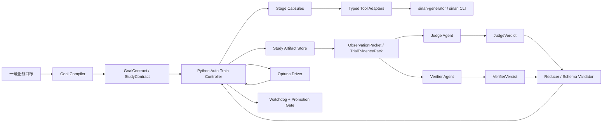

# 自主训练控制器与 OpenCode 接入设计

- 文档状态：草稿
- 当前阶段：DESIGN
- 最近更新：2026-04-21
- 目标读者：项目维护者、训练链路实现者、agent/skill 实现者
- 负责人：Codex
- 上游输入：
  - `docs/04-project-development/03-requirements/prd.md`
  - `docs/04-project-development/03-requirements/requirements-analysis.md`
  - `docs/04-project-development/04-design/technical-selection.md`
- 下游交付：
  - `packages/sinan-captcha/src/auto_train/` 模块设计
  - `.opencode/commands/` 与 `.opencode/skills/` 设计
  - 自主训练任务拆解与后续实施顺序
- 关联需求：`REQ-007`、`REQ-011`、`REQ-012`、`REQ-013`、`NFR-006`、`NFR-009`

## 1. 设计目标

### 1.1 2026-04-21 icon-embedder 种子继承约束

`group1 icon-embedder` 的 base/hard 两阶段训练必须避免把 hard 阶段覆盖后的 checkpoint 误当成下一轮 base 起点。当前约束如下：

- `TRAIN_EMBEDDER_BASE` 从历史 run 继承时，优先选择 `embedder_backups/pre_hard_*/best.pt|last.pt` 中保存的 hard 前 base checkpoint。
- 若历史 run 没有 hard 前备份，则保留对旧 run 的兼容 fallback，继续使用现有 `icon-embedder/weights/best.pt|last.pt`。
- `icon-embedder` component base run 只在相同 seed compatibility key 的候选池内排序；key 包含 task、dataset_version、dataset_override、component 和 base stage，不包含 epochs/batch/learning 参数。
- 候选评分应优先反映 identity/exact retrieval 与 same-template 混淆控制，而不是单纯 scene recall。
- runner 允许 `group1 icon-embedder` 在 `from_run` 下显式 checkpoint，以便 controller 把解析出的 base-stage checkpoint 传给训练命令。

这份设计解决的不是“怎么让 AI 更自由”，而是“怎么让自主训练长时间运行时仍然可控、可恢复、可审计”。

首版目标固定为：

1. 在现有 `sinan-generator` 与 `sinan` CLI 之上增加自主训练控制平面。
2. 第一版先支持 `opencode`，把它作为 agent 运行时和 skill/command 容器。
3. 把结果查看、结果压缩、判断、数据规划和归档拆成独立职责单元。
4. 把长期记忆转移到 study 状态文件，而不是持续堆积聊天上下文。
5. 第一组与第二组共享控制器骨架，但各自保持独立 study 和指标。
6. 吸收 CLI harness 方法论，把大模型的主观能动性放大为“预算内搜索能力”，而不是放大为“自由命令执行权”。

## 2. 为什么 V1 先接入 OpenCode

`OpenCode` 官方已经提供 CLI、headless `run`、custom commands、agents、skills 和权限控制，适合拿来承载“结构化判断”而不是“自由 shell 代理”。设计结论：

- V1 不需要把仓库重写成 OpenCode 专用项目。
- V1 只需要把自主训练里最适合 AI 的环节接入 OpenCode。
- 确定性执行仍由 Python 控制器负责，避免 agent 漂移。

### 2.1 Harness 方法论如何融入

这里吸收的不是某个具体仓库的 UI 或 CLI 皮相，而是 harness 的 6 个核心方法论：

1. `Action space` 先于 prompt：
   - 先定义允许动作集，再让模型输出 verdict。
   - 自主训练里允许的正式动作应收口为 `KEEP_TRAINING`、`RETUNE`、`REGENERATE_DATA`、`RETEST`、`STOP`、`PROMOTE_CANDIDATE`。
2. `Typed tools` 先于原始 shell：
   - `sinan-generator` 与 `sinan train/test/evaluate/release` 不是直接暴露给模型的原始工具，而是先封装成 stage tool adapters。
3. `Observation space` 先于长日志：
   - 模型看到的是 `ObservationPacket` 与 `TrialEvidencePack`，不是终端长输出和目录树。
4. `Single executor` 先于多 agent 自由协作：
   - 可以有多个 agent 角色做解释、比较和核查，但真正执行命令的只能是 Python 控制器。
5. `Event sourcing` 先于聊天记忆：
   - 所有长期事实都必须先落到 study/trial 工件，再供后续阶段消费。
6. `Autonomy budget + gates` 先于“无限自问自答”：
   - 真正的无人值守不是无限循环，而是在预算、看门狗和晋级门之内持续搜索最优候选。

## 3. 首版范围与非范围

### 3.1 V1 范围

- `group1` 与 `group2` 都支持自主训练 study
- 串行单机 trial 执行
- 一句话目标编译到 `GoalContract` / `StudyContract`
- `study`/`trial` 状态落盘
- `opencode` command + skill 接入
- `Judge` / `Verifier` 双角色 verdict
- JSON 决策校验与 fallback
- 可暂停、可恢复、可归档
- 可选接入 `Optuna`
- 看门狗、自动验收和晋级门

### 3.2 V1 非范围

- 分布式 trial 调度
- 多机协同训练
- 不受限的 agent 自由 bash
- 依赖聊天历史作为唯一记忆
- 让 AI 直接改写训练数据或模型工件
- 让多个 agent 并行自由调用训练 CLI

## 4. 总体架构



核心边界：

- Python 控制器负责阶段推进和持久化恢复。
- 每个阶段都应收敛为单次执行、单次产出的 stage capsule。
- OpenCode 负责解释、判断和交叉核查。
- `Optuna` 负责搜索数值参数。
- 所有长期事实都先写盘再流转。
- harness 负责限定动作空间、观测空间、恢复空间和晋级门。

### 4.2 Harness 分层

- `Goal layer`
  - 把自然语言目标编译成 `GoalContract` / `StudyContract`。
- `Execution layer`
  - 由 Python 控制器和 typed tool adapters 独占执行权。
- `Observation layer`
  - 把试验结果压缩成可供模型消费的观测包。
- `Judgment layer`
  - 由 `Judge`、`Verifier` 和 `Reducer` 组成结构化 verdict 链。
- `Gate layer`
  - 由 watchdog、promotion gate 和 solver smoke gate 组成正式无人值守门。

### 4.1 当前骨架落地形态

当前仓库已经落地第一版控制器骨架：

- `uv run sinan auto-train run <task> --study-name ... --train-root ... --generator-workspace ...`
- `uv run sinan auto-train stage <stage> <task> --study-name ... --train-root ... --generator-workspace ...`

当前骨架的固定原则：

- `run` 负责根据已落盘工件自动推断当前阶段，并顺序执行多个 stage。
- `stage` 负责只运行一个阶段胶囊，便于手工调试、重放和训练机脚本编排。
- 阶段之间只通过 `study.json`、`trial/*.json`、`leaderboard.json` 等工件接力，不继承聊天上下文。
- 当前 `SUMMARIZE` 已支持切到真实 `opencode run --command result-read ...`，并通过 `--attach` 连接 headless server。
- 当前 `JUDGE` 已支持切到真实 `opencode run --command judge-trial ...`。
- 当前 `RETUNE` 在 `judge_provider = opencode` 时，已支持切到真实 `opencode run --command plan-retune ...`。
- 控制器会先本地落 `trial_analysis.json`，再把错误样本摘要、当前参数和 `group1` 组件诊断交给 `plan-retune`，输出 `retune_plan.json`。
- 当前 `group1` 组件 gate 已支持早期质量干预：`query-gate`、`scene-gate`、`embedder-gate` 若出现严重召回、严格命中或误检问题，控制器会写出 `early_intervention.json`，同时落盘 `result_summary.json` 与 `trial_analysis.json`，然后直接进入 `JUDGE -> NEXT_ACTION`，避免继续执行下游无效训练。
- 当前 `group1 icon-embedder` base review 已支持无效训练 fuse：即使 `opencode` 的 `review-embedder` 在 `LLM-first` 模式下返回 `CONTINUE`，只要本地证据显示 exact retrieval 长期极低、`best_epoch` 已落后至少 3 轮且同模板/正样本排名混淆仍严重，协议层会强制改写为 `STOP_AND_ADVANCE`，进入 `EMBEDDER_GATE` 后再由 gate 早期干预或 retune 闭环接管。
- 当前 `group1` 的 `retune_plan.json` 已支持：
  - `query-detector`
  - `proposal-detector`
  - `icon-embedder`
  三个组件逐个决定 `train/reuse`，并单独覆盖 `model`、`epochs`、`batch`、`imgsz`。
- 当前 `REGENERATE_DATA` 分流已支持切到真实 `opencode run --command plan-dataset ...`。
- 当前 `REGENERATE_DATA` 产出的 `dataset_plan.json` 已会进入下一轮 `BUILD_DATASET`：
  - 控制器会把 `generator_preset` 写入下一轮 `input.json`
  - 控制器会把 `generator_overrides` 物化为 trial 级 `generator_override.json`
  - `sinan-generator make-dataset` 会通过 `--preset` 和 `--override-file` 消费这些数据控制参数
- 当前 study 级归档摘要已支持切到真实 `opencode run --command study-status ...`。
- 当前 `JUDGE` 在 `opencode` 运行失败、超时或返回非法 JSON 时，会稳定回退到 rules + policy fallback。
- 当前 `SUMMARIZE` / `plan-retune` / `plan-dataset` / `study-status` 在 `opencode` 运行失败、超时或返回非法 JSON 时，也会稳定回退到本地确定性实现。
- 当前 `RETUNE` 在非 `opencode` 路线仍可切到真实 `Optuna` runtime：
  - 先把当前完成 trial 注册到 `optuna.sqlite3`
  - 再为下一轮生成建议参数并写回 `input.json`
  - 若 `Optuna` 缺失或 runtime 失败，则稳定回退到 deterministic fallback 参数

当前推荐启动方式：

1. `opencode serve --port 4096`
2. `uv run sinan auto-train run group1 --study-name study_001 --train-root <train-root> --generator-workspace <workspace> --judge-provider opencode --judge-model gemma4 --opencode-attach-url http://127.0.0.1:4096`

这意味着 V1 现在已经具备“Python 控制器 -> OpenCode CLI/server -> `result_summary.json` / `trial_analysis.json` / `decision.json` / `retune_plan.json` / `dataset_plan.json` / `study_status.json` -> 控制器继续下一阶段”的真实调用链。

## 5. Study 与 Trial 目录契约

建议目录：

```text
studies/
  group1/
    study_001/
      study.json
      best_trial.json
      trial_history.jsonl
      decisions.jsonl
      leaderboard.json
      summary.md
      STOP
      trials/
        trial_0001/
          input.json
          dataset.json
          train.json
          query_gate.json
          scene_gate.json
          embedder_gate.json
          early_intervention.json
          test.json
          evaluate.json
          trial_analysis.json
          retune_plan.json
          dataset_plan.json
          generator_override.json
          decision.json
          summary.md
  group2/
    study_001/
      ...
```

硬规则：

- 每个 group 一个 study 根目录。
- 每个 trial 一个独立目录。
- 所有决策必须有独立 `decision.json`。
- summary 只保留决策必要字段，原始长日志不进入 AI 上下文。

## 6. 状态机

控制器固定使用显式状态机：

1. `PLAN`
2. `BUILD_DATASET`
3. `TRAIN`
4. `TEST`
5. `EVALUATE`
6. `SUMMARIZE`
7. `JUDGE`
8. `NEXT_ACTION`
9. `STOP`

`group1` 会把 `TRAIN` 拆成 `TRAIN_QUERY / QUERY_GATE / TRAIN_SCENE / SCENE_GATE / TRAIN_EMBEDDER_BASE / EMBEDDER_GATE / BUILD_EMBEDDER_HARDSET / TRAIN_EMBEDDER_HARD / CALIBRATE_MATCHER / OFFLINE_EVAL / BUSINESS_EVAL`。其中三个 gate 可以在严重失败时提前跳转到 `JUDGE`，`TRAIN_EMBEDDER_BASE` 还会在 review 协议层识别无意义续训并提前推进到 `EMBEDDER_GATE`；恢复逻辑会优先识别 `early_intervention.json`，不会因为后续训练工件缺失而回到无效训练阶段。

停止条件：

- 达到目标指标
- 达到最大 trial 数
- 达到最大训练小时数
- 连续 N 轮无提升
- 命中 STOP 文件
- runner 致命失败
- watchdog 超时或连续心跳缺失
- 连续 schema 拒收或连续 verdict 冲突超过阈值

## 7. OpenCode 接入面

### 7.1 项目内命令目录

建议目录：

```text
.opencode/
  commands/
    result-read.md
    judge-trial.md
    plan-retune.md
    plan-dataset.md
    study-status.md
  skills/
    result-reader/SKILL.md
    training-judge/SKILL.md
    retune-planner/SKILL.md
    dataset-planner/SKILL.md
    study-archivist/SKILL.md
```

### 7.2 命令职责

- `result-read`
  - 输入：`test.json`、`evaluate.json`
  - 输出：压缩后的 `result_summary.json`
- `judge-trial`
  - 输入：当前 trial 摘要 + 最近 N 轮摘要
  - 输出：`decision.json`
- `plan-retune`
  - 输入：`result_summary.json` + `trial_analysis.json`
  - 输出：下一轮调参策略 JSON，包含全局参数调整，以及 `group1` 组件级 `train/reuse` 与参数覆盖
- `plan-dataset`
  - 输入：弱类统计、失败样本模式
  - 输出：下一轮数据策略 JSON，包含 `dataset_action`、`generator_preset` 和最小 `generator_overrides`
- `study-status`
  - 输入：`study.json`、`leaderboard.json`
  - 输出：当前 study 中文摘要

### 7.3 Skills 职责

- `result-reader`
  - 只做结果压缩，不做下一步决策
- `training-judge`
  - 只做动作判断，不直接跑命令
- `retune-planner`
  - 只做下一轮训练策略规划，不直接跑命令
- `dataset-planner`
  - 只做数据策略建议与 generator 数据控制建议
- `study-archivist`
  - 只做总结与归档建议

### 7.4 权限原则

V1 推荐权限：

- `plan` agent：
  - `edit`: `deny`
  - `bash`: `deny` 或 `ask`
  - 重点使用 command/skill 读摘要文件
- `build` agent：
  - 不参与自动循环，只保留给维护者手工调试

设计结论：

- 自主训练循环里不应让 agent 自由执行训练 shell。
- 所有 runner 命令均由 Python 控制器或受限 stage capsule 发起。
- 主观能动性通过目标驱动、策略生成、交叉核查和结果归纳来放大，而不是通过扩大 shell 权限来放大。

### 7.5 Stage Capsule 约束

V1 的实际执行形态不是“长上下文 agent 会话”，而是“阶段胶囊”：

- `PLAN`
- `BUILD_DATASET`
- `TRAIN`
- `TEST`
- `EVALUATE`
- `SUMMARIZE`
- `JUDGE`
- `NEXT_ACTION`

每个阶段胶囊都必须满足：

- 只读取固定输入工件
- 最多触发一次受限包装 CLI 或 runner
- 只写入本阶段约定的输出工件
- 执行完成后立即退出
- 下一阶段只能读取输出工件，不继承前一阶段上下文

这也是 V1 保持“更内聚 skill/command 单元”但又不把长期状态放进 agent 会话的核心办法。

### 7.6 最大化主观能动性的正式机制

要让大模型真正发挥作用，关键不是给它更多原始工具，而是给它更好的自主空间：

1. 目标驱动而不是命令驱动：
   - 维护者告诉系统“要达成什么业务结果”，而不是逐条告诉模型怎么调参。
2. 观测驱动而不是日志驱动：
   - 模型只看和决策有关的结构化证据，减少噪声和幻觉入口。
3. 多角色驱动而不是单次回答：
   - `Judge` 负责提出动作，`Verifier` 负责挑错，`Reducer` 负责收口。
4. 预算驱动而不是无限循环：
   - 真正的主动性是“在固定预算内做最优搜索”，而不是“永不停止地重跑试验”。
5. Gate 驱动而不是单指标驱动：
   - 模型可以主动争取更高分，但只有通过 solver gate 的候选才允许晋级。

### 7.7 真正无人值守的定义

本项目里“无人值守”必须同时满足下面 5 条：

1. study 可从落盘工件恢复，不依赖聊天上下文。
2. 长流程卡死、超时、schema 拒收和 verdict 冲突都能被 watchdog 发现。
3. 任何被接受的 agent 输出都可审计、可重放、可追溯到输入哈希。
4. 候选模型只有通过自动验收和 solver smoke gate 后才允许晋级。
5. 训练机操作者不需要手工编辑 JSON、手工补 prompt 或手工拼命令。

## 8. 决策 JSON 契约

Judge 只允许输出结构化 JSON：

```json
{
  "decision": "RETUNE",
  "reason": "recall_is_bottleneck",
  "confidence": 0.82,
  "next_action": {
    "dataset_action": "reuse",
    "train_action": "from_run",
    "base_run": "trial_0004",
    "parameter_space": {
      "epochs": [120, 140, 160],
      "batch": [8, 16],
      "imgsz": [512, 640]
    }
  },
  "evidence": [
    "map50_95 plateau for 3 trials",
    "weak classes: icon_camera, icon_leaf"
  ]
}
```

Harness 目标动作仅限：

- `KEEP_TRAINING`
- `RETUNE`
- `REGENERATE_DATA`
- `RETEST`
- `STOP`
- `PROMOTE_CANDIDATE`

与当前实现的映射关系：

- `KEEP_TRAINING` -> 当前实现中的 `RESUME`
- `PROMOTE_CANDIDATE` -> 当前实现中的 `PROMOTE_BRANCH`
- `STOP` -> 当前实现中的 `ABANDON_BRANCH` 或命中停止规则后的终止

非法 JSON 或非法动作时：

- 控制器写入失败记录
- 切换到规则 fallback
- 当前 trial 仍然归档

## 9. Group1 与 Group2 策略隔离

### 9.1 Group1

- 主目标：`map50_95`
- 次目标：`recall`
- 业务指标：`full_sequence_hit_rate`
- plateau 规则：最近 `3` 轮主指标提升不足 `0.005`
- `PROMOTE_BRANCH` 条件：
  - `map50_95 >= 0.82`
  - `recall >= 0.88`
  - `full_sequence_hit_rate >= 0.85`
  - 不存在 `weak_classes`
  - 不存在 `sequence_consistency` / `order_errors`
- `REGENERATE_DATA` 条件：
  - 出现 `weak_classes`
  - 或出现 `sequence_consistency` / `order_errors`
- `ABANDON_BRANCH` 条件：
  - `trend = declining`
  - 且 `delta_vs_best <= -0.06`
  - 且 `map50_95 < 0.75`
- 常见动作：
  - 召回瓶颈：`RETUNE`
  - 弱类持续不稳：`REGENERATE_DATA`
  - 达标：`PROMOTE_BRANCH`

### 9.2 Group2

- 主目标：`point_hit_rate`
- 次目标：`mean_iou`
- 惩罚项：`mean_center_error_px`
- plateau 规则：最近 `3` 轮主指标提升不足 `0.01`
- `PROMOTE_BRANCH` 条件：
  - `point_hit_rate >= 0.93`
  - `mean_iou >= 0.85`
  - `mean_center_error_px <= 8.0`
  - 不存在 `point_hits` / `low_iou` / `center_offset`
- `REGENERATE_DATA` 条件：
  - `point_hit_rate < 0.80`
  - 或出现 `low_iou`
  - 或 `point_hits` 持续出现且失败样本偏多
- `ABANDON_BRANCH` 条件：
  - `trend = declining`
  - 且 `delta_vs_best <= -0.08`
  - 且 `point_hit_rate < 0.75`
- 常见动作：
  - 定位误差居高不下：`RETUNE`
  - 复杂背景/低对比失败：`REGENERATE_DATA`
  - 达标：`PROMOTE_BRANCH`

结论：

- 两组不能共享一个总排行榜。
- 只能共享控制器代码和 study 契约。

## 10. Optuna 位置

`Optuna` 在这套设计里不是 judge，而是非 `opencode` `RETUNE` 路线的参数搜索器。

顺序固定为：

1. Judge 决定方向
2. 若 `judge_provider = opencode` 且动作是 `RETUNE`：`plan-retune` 读取 `trial_analysis.json` 产出 `retune_plan.json`
3. 若不是 `opencode` `RETUNE`：`Optuna` 在允许空间里选参数
4. 控制器执行下一轮 trial

也就是说：

- AI 负责“要不要调参”
- `retune-planner` 或 `Optuna` 负责“怎么调”

### 10.1 允许搜索的固定参数空间

`Optuna` 只能在固定白名单空间中搜索，不能自由扩张参数维度。

- `group1`
  - `model`: `yolo26n.pt`, `yolo26s.pt`
  - `epochs`: `100`, `120`, `140`, `160`
  - `batch`: `8`, `16`
  - `imgsz`: `512`, `640`
- `group2`
  - `model`: `paired_cnn_v1`
  - `epochs`: `80`, `100`, `120`, `140`
  - `batch`: `8`, `16`
  - `imgsz`: `160`, `192`, `224`

硬规则：

- `Optuna` 只在 `decision = RETUNE` 且当前不是 `opencode retune-planner` 路线时介入。
- `REGENERATE_DATA`、`PROMOTE_BRANCH`、`ABANDON_BRANCH`、`RESUME` 均不得进入参数搜索。
- `Optuna` 不得引入 CLI 当前未支持的训练参数。

### 10.2 pruning 与 no-improve 交互

- 若当前 decision 不是 `RETUNE`：
  - 不进入 pruning
  - 不启动 `Optuna`
- 若命中 plateau，但 `no_improve_trials` 尚未达到上限：
  - 当前候选 trial 可被 pruning
  - 搜索仍可继续
- 若 `no_improve_trials` 达到上限：
  - 停止当前 `Optuna` 搜索
  - 切回规则 fallback
- 若规则层已经判定当前 trial 应 `PROMOTE_BRANCH` / `REGENERATE_DATA` / `ABANDON_BRANCH`：
  - 直接停止 `Optuna`
  - 不允许搜索器覆盖业务边界

### 10.3 纯规则 fallback

当出现下面任一情况时，控制器不得因为 `Optuna` 缺失或 AI 输出异常而卡死：

- `Optuna` 运行时不可用
- `judge` 输出非法 JSON
- `judge` 输出与规则边界冲突
- 搜索已达到 no-improve 上限

此时回退规则固定为：

- 先按 `group1/group2` policy 计算动作边界
- 若动作不是 `RETUNE`：
  - 直接执行规则动作
- 若动作是 `RETUNE` 且当前走 `opencode`：
  - 先尝试 `plan-retune`
  - 若命令失败或输出非法，则回退到基于 `trial_analysis.json` 的 deterministic retune plan
- 若动作仍是 `RETUNE` 但 `Optuna` 不可用或 runtime 失败：
  - 使用固定 deterministic fallback 参数继续下一轮
  - `group1` 与 `group2` 分别使用各自默认 fallback 参数模板

## 11. 失败与恢复策略

### 11.1 失败策略

- `results.csv` 缺失但可从终端解析：继续
- `decision.json` 非法：fallback
- `test` 或 `evaluate` 缺失：trial 失败，禁止晋级
- runner 非零退出：记录后按策略重试或停止

### 11.2 恢复策略

- 以 `study.json` 为恢复入口
- 以 `current_trial_id` 判定恢复点
- 以最近完整 trial 工件判定是否需要重跑当前阶段

## 12. 实施顺序与当前进度

当前已完成：

1. `study/trial` 契约、状态机、layout/recovery、runners、summary
2. OpenCode commands 与 skills 契约
3. `group1/group2` policy 和 `Optuna` 边界冻结
4. `auto-train` 控制器骨架与 `run/stage` CLI 入口

当前仍待完成：

1. Windows + NVIDIA 训练机上的 `optuna.sqlite3` / 恢复 / 停止 / fallback 演练
2. 至少一条从 `PLAN` 到 `STOP` 的端到端 study 演练
3. 真实训练预算下的 `Optuna` 搜索效果与性能开销复核

详细任务见：

- [自主训练任务拆解](../05-development-process/autonomous-training-task-breakdown.md)

## 13. 参考来源

- [OpenCode Intro](https://opencode.ai/docs/)
- [OpenCode CLI](https://opencode.ai/docs/cli/)
- [OpenCode Commands](https://opencode.ai/docs/commands/)
- [OpenCode Agents](https://opencode.ai/docs/agents/)
- [OpenCode Skills](https://opencode.ai/docs/skills/)
- [Optuna Installation](https://optuna.readthedocs.io/en/stable/installation.html)
- [Optuna Study](https://optuna.readthedocs.io/en/latest/reference/study.html)
