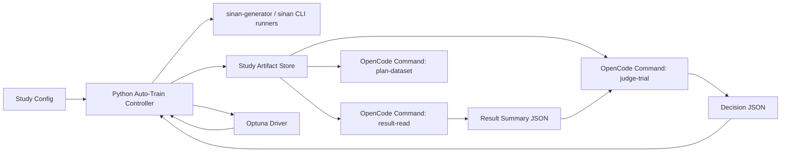

# 自主训练控制器与 OpenCode 接入设计

- 文档状态：草稿
- 当前阶段：DESIGN
- 最近更新：2026-04-04
- 目标读者：项目维护者、训练链路实现者、agent/skill 实现者
- 负责人：Codex
- 上游输入：
  - `docs/04-project-development/03-requirements/prd.md`
  - `docs/04-project-development/03-requirements/requirements-analysis.md`
  - `docs/04-project-development/04-design/technical-selection.md`
- 下游交付：
  - `core/auto_train/` 模块设计
  - `.opencode/commands/` 与 `.opencode/skills/` 设计
  - 自主训练任务拆解与后续实施顺序
- 关联需求：`REQ-008`、`REQ-009`、`NFR-006`

## 1. 设计目标

这份设计解决的不是“怎么让 AI 更自由”，而是“怎么让自主训练长时间运行时仍然可控、可恢复、可审计”。

首版目标固定为：

1. 在现有 `sinan-generator` 与 `sinan` CLI 之上增加自主训练控制平面。
2. 第一版先支持 `opencode`，把它作为 agent 运行时和 skill/command 容器。
3. 把结果查看、结果压缩、判断、数据规划和归档拆成独立职责单元。
4. 把长期记忆转移到 study 状态文件，而不是持续堆积聊天上下文。
5. 第一组与第二组共享控制器骨架，但各自保持独立 study 和指标。

## 2. 为什么 V1 先接入 OpenCode

`OpenCode` 官方已经提供 CLI、headless `run`、custom commands、agents、skills 和权限控制，适合拿来承载“结构化判断”而不是“自由 shell 代理”。设计结论：

- V1 不需要把仓库重写成 OpenCode 专用项目。
- V1 只需要把自主训练里最适合 AI 的环节接入 OpenCode。
- 确定性执行仍由 Python 控制器负责，避免 agent 漂移。

## 3. 首版范围与非范围

### 3.1 V1 范围

- `group1` 与 `group2` 都支持自主训练 study
- 串行单机 trial 执行
- `study`/`trial` 状态落盘
- `opencode` command + skill 接入
- JSON 决策校验与 fallback
- 可暂停、可恢复、可归档
- 可选接入 `Optuna`

### 3.2 V1 非范围

- 分布式 trial 调度
- 多机协同训练
- 不受限的 agent 自由 bash
- 依赖聊天历史作为唯一记忆
- 让 AI 直接改写训练数据或模型工件

## 4. 总体架构



核心边界：

- Python 控制器负责执行。
- OpenCode 负责解释和判断。
- `Optuna` 负责搜索数值参数。
- 所有长期事实都先写盘再流转。

## 5. Study 与 Trial 目录契约

建议目录：

```text
studies/
  group1/
    study_001/
      study.json
      best_trial.json
      trial_history.jsonl
      decisions.jsonl
      leaderboard.json
      summary.md
      STOP
      trials/
        trial_0001/
          input.json
          dataset.json
          train.json
          test.json
          evaluate.json
          decision.json
          summary.md
  group2/
    study_001/
      ...
```

硬规则：

- 每个 group 一个 study 根目录。
- 每个 trial 一个独立目录。
- 所有决策必须有独立 `decision.json`。
- summary 只保留决策必要字段，原始长日志不进入 AI 上下文。

## 6. 状态机

控制器固定使用显式状态机：

1. `PLAN`
2. `BUILD_DATASET`
3. `TRAIN`
4. `TEST`
5. `EVALUATE`
6. `SUMMARIZE`
7. `JUDGE`
8. `NEXT_ACTION`
9. `STOP`

停止条件：

- 达到目标指标
- 达到最大 trial 数
- 达到最大训练小时数
- 连续 N 轮无提升
- 命中 STOP 文件
- runner 致命失败

## 7. OpenCode 接入面

### 7.1 项目内命令目录

建议目录：

```text
.opencode/
  commands/
    result-read.md
    judge-trial.md
    plan-dataset.md
    study-status.md
  skills/
    result-reader/SKILL.md
    training-judge/SKILL.md
    dataset-planner/SKILL.md
    study-archivist/SKILL.md
```

### 7.2 命令职责

- `result-read`
  - 输入：`test.json`、`evaluate.json`
  - 输出：压缩后的 `result_summary.json`
- `judge-trial`
  - 输入：当前 trial 摘要 + 最近 N 轮摘要
  - 输出：`decision.json`
- `plan-dataset`
  - 输入：弱类统计、失败样本模式
  - 输出：下一轮数据策略 JSON
- `study-status`
  - 输入：`study.json`、`leaderboard.json`
  - 输出：当前 study 中文摘要

### 7.3 Skills 职责

- `result-reader`
  - 只做结果压缩，不做下一步决策
- `training-judge`
  - 只做动作判断，不直接跑命令
- `dataset-planner`
  - 只做数据策略建议
- `study-archivist`
  - 只做总结与归档建议

### 7.4 权限原则

V1 推荐权限：

- `plan` agent：
  - `edit`: `deny`
  - `bash`: `deny` 或 `ask`
  - 重点使用 command/skill 读摘要文件
- `build` agent：
  - 不参与自动循环，只保留给维护者手工调试

设计结论：

- 自主训练循环里不应让 agent 自由执行训练 shell。
- 所有 runner 命令均由 Python 控制器发起。

## 8. 决策 JSON 契约

Judge 只允许输出结构化 JSON：

```json
{
  "decision": "RETUNE",
  "reason": "recall_is_bottleneck",
  "confidence": 0.82,
  "next_action": {
    "dataset_action": "reuse",
    "train_action": "from_run",
    "base_run": "trial_0004",
    "parameter_space": {
      "epochs": [120, 140, 160],
      "batch": [8, 16],
      "imgsz": [512, 640]
    }
  },
  "evidence": [
    "map50_95 plateau for 3 trials",
    "weak classes: icon_camera, icon_leaf"
  ]
}
```

允许动作仅限：

- `RETUNE`
- `REGENERATE_DATA`
- `RESUME`
- `PROMOTE_BRANCH`
- `ABANDON_BRANCH`

非法 JSON 或非法动作时：

- 控制器写入失败记录
- 切换到规则 fallback
- 当前 trial 仍然归档

## 9. Group1 与 Group2 策略隔离

### 9.1 Group1

- 主目标：`map50_95`
- 次目标：`recall`
- 业务指标：`full_sequence_hit_rate`
- 常见动作：
  - 召回瓶颈：`RETUNE`
  - 弱类持续不稳：`REGENERATE_DATA`
  - 达标：`PROMOTE_BRANCH`

### 9.2 Group2

- 主目标：`point_hit_rate` 或 `mean_iou`
- 次目标：`map50_95`
- 惩罚项：`mean_center_error_px`
- 常见动作：
  - 定位误差居高不下：`RETUNE`
  - 复杂背景/低对比失败：`REGENERATE_DATA`
  - 达标：`PROMOTE_BRANCH`

结论：

- 两组不能共享一个总排行榜。
- 只能共享控制器代码和 study 契约。

## 10. Optuna 位置

`Optuna` 在这套设计里不是 judge，而是参数搜索器。

顺序固定为：

1. Judge 决定方向
2. `Optuna` 在允许空间里选参数
3. 控制器执行下一轮 trial

也就是说：

- AI 负责“要不要调参”
- `Optuna` 负责“怎么调”

## 11. 失败与恢复策略

### 11.1 失败策略

- `results.csv` 缺失但可从终端解析：继续
- `decision.json` 非法：fallback
- `test` 或 `evaluate` 缺失：trial 失败，禁止晋级
- runner 非零退出：记录后按策略重试或停止

### 11.2 恢复策略

- 以 `study.json` 为恢复入口
- 以 `current_trial_id` 判定恢复点
- 以最近完整 trial 工件判定是否需要重跑当前阶段

## 12. 实施顺序

V1 建议拆为四段：

1. 先做 study 契约与控制器骨架
2. 再做 OpenCode commands 与 skills
3. 再做 `Optuna` 接入
4. 最后做 group1/group2 策略和恢复/停止回归

详细任务见：

- [自主训练任务拆解](../05-development-process/autonomous-training-task-breakdown.md)

## 13. 参考来源

- [OpenCode Intro](https://opencode.ai/docs/)
- [OpenCode CLI](https://opencode.ai/docs/cli/)
- [OpenCode Commands](https://opencode.ai/docs/commands/)
- [OpenCode Agents](https://opencode.ai/docs/agents/)
- [OpenCode Skills](https://opencode.ai/docs/skills/)
- [Optuna Installation](https://optuna.readthedocs.io/en/stable/installation.html)
- [Optuna Study](https://optuna.readthedocs.io/en/latest/reference/study.html)
