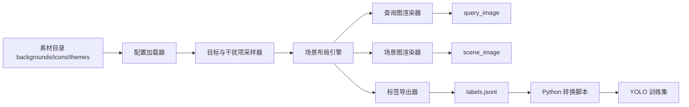

# 图形点选样本生成器完整方案

- 文档状态：草稿
- 当前阶段：DESIGN
- 目标读者：架构/开发、训练实施者
- 负责人：Codex
- 上游输入：
  - `graphical_captcha_training_guide.md`
  - 参考样本图：图形点选查询图 + 场景图
  - `docs/04-project-development/03-requirements/prd.md`
  - `docs/04-project-development/04-design/technical-selection.md`
- 下游交付对象：
  - 生成器实现者
  - 数据导出/转换脚本实现者
  - 训练流水线维护者
- 关联需求：`REQ-002`、`REQ-004`、`REQ-005`、`REQ-007`、`REQ-008`

## 1. 方案结论

针对“查询图是 2-4 个深色图标，场景图是照片背景上散布多个相似图标”的样本类型，首版生成器方案固定为：

1. 直接基于 `go-captcha` 核心库思路实现内部生成器，不依赖 `go-captcha-service` 公共接口导数据。
2. 生成器核心用 Go 实现，训练、转换和评估继续用 Python。
3. 生成器只负责产出 `gold` 样本，不负责训练。
4. 生成器输出两张图：
   - `query_image`：查询图
   - `scene_image`：场景图
5. 生成器输出一份 JSONL 真值标签，作为主事实源。

这里的关键判断是：

- `go-captcha-service` 适合“把验证码跑起来”
- 训练样本生成器适合“把图片、排布元数据、真值标签一起导出来”
- 这两件事不是一回事

## 2. 为什么不能只拿现成服务改配置

如果只把 `go-captcha-service` 跑起来，再从服务接口拿图片，你通常只能稳定拿到：

- 查询图
- 场景图
- 部分点击点信息

但训练首版真正需要的是：

- 每个目标的类别
- 每个目标的顺序
- 每个目标的 `bbox`
- 每个目标的 `center`
- 每个干扰项的 `bbox`
- 当前批次的素材、参数和随机种子

只靠黑盒服务接口，标签不够完整，也不方便做数据回溯。因此首版应该这样用 `go-captcha`：

1. 参考它的图形点选语义和素材组织方式
2. 直接使用它的图形点选能力和资源约定
3. 自己掌控“选图标、排布局、渲染、导标签”的完整过程

结论：

- 不是“改一份配置就够了”
- 是“基于 `go-captcha` 自己写一个图形点选样本合成器”

## 3. 目标样本特征

目标样本的视觉结构固定如下：

### 3.1 查询图

- 单独一张小图，不和场景图合并保存
- 显示 2-4 个待点击图标
- 图标为深色剪影风格
- 背景尽量简单，避免干扰识别
- 图标顺序就是用户点击顺序

### 3.2 场景图

- 单独一张背景照片
- 照片上散布多个深色图标
- 目标图标和干扰图标混排
- 图标允许轻微缩放、轻微旋转和轻微透明度变化
- 图标之间不允许严重重叠

### 3.3 标签要求

- 查询图中的每个图标都必须能在场景图中找到唯一对应目标
- 第一专项首版默认不允许“同类目标重复出现”
- 干扰项类别默认不得与目标类别重复
- 所有目标和干扰项都必须可导出精确 `bbox`

## 4. 与训练方案的关系

这是实施时最容易搞混的地方，必须固定：

1. 生成器负责造数据
2. 转换脚本负责把 JSONL 变成 YOLO 数据集
3. 训练脚本负责用 `yolo26n.pt` 微调检测模型

更具体一点：

- 训练第一专项检测模型时，YOLO 直接消费的是 `scene_image + bbox/class`
- `query_image` 不直接进入首版 YOLO 检测训练
- `query_image` 用于任务级后处理、顺序映射、验收回放

所以生成器输出的数据比 YOLO 训练直接需要的数据更多，这是正常设计，不是冗余。

## 5. 总体架构



## 6. 技术路线

## 6.1 语言边界

- Go：
  - 负责生成器核心
  - 负责素材加载、排布、渲染、导出
  - 负责批量生成
- Python：
  - 负责 JSONL 校验
  - 负责转换 YOLO 标签
  - 负责训练、评估、回灌

## 6.2 为什么生成器核心选 Go

- `go-captcha` 本身是 Go 库
- 直接在 Go 里拿素材和坐标，避免跨服务接口丢信息
- 批量生成图片时，单一语言链路更稳定
- 后续如果真要把训练生成器衍生为内部验证码服务，Go 更容易复用

## 6.3 为什么不用 `go-captcha-service` 当训练生成器

- 它偏运行时服务
- 它的公共接口不是为导出完整训练真值设计的
- 训练需要完整排布元数据，最好在生成时就直接掌控

## 7. 推荐仓内目录

这是生成器自己的目录，不等于整个训练项目目录。

```text
generator/
  go.mod
  cmd/
    sinan-click-generator/
      main.go
  internal/
    config/
    material/
    sampler/
    layout/
    render/
    export/
    qa/
  configs/
    default.yaml
    smoke.yaml
  materials/
    backgrounds/
      train/
      val/
      test/
    icons/
      icon_house/
      icon_leaf/
      icon_ship/
    manifests/
      classes.yaml
      backgrounds.csv
  output/
    group1/
      batch_0001/
        query/
        scene/
        labels.jsonl
        manifest.json
        qa-contact-sheet.jpg
```

## 8. 模块设计

### 8.1 `config`

- 读取 YAML 配置
- 固定随机种子
- 固定样本数量、图片尺寸、目标数范围、干扰数范围

### 8.2 `material`

- 加载背景图
- 加载图标 PNG
- 校验类别和素材目录是否一致
- 生成素材索引缓存

### 8.3 `sampler`

- 随机选择目标类别
- 随机选择干扰类别
- 控制类别均衡
- 控制每张图的目标数量与干扰数量

### 8.4 `layout`

- 为每个图标采样位置、缩放、旋转、透明度
- 检查碰撞和越界
- 保证目标和干扰项都能导出 `bbox`

### 8.5 `render`

- 渲染查询图
- 渲染场景图
- 保证查询图和场景图使用同一批目标定义

### 8.6 `export`

- 保存 `query_image`
- 保存 `scene_image`
- 保存 `labels.jsonl`
- 保存 `manifest.json`

### 8.7 `qa`

- 生成抽检拼图
- 输出类别分布和失败样本统计
- 在导出前做基础质量校验

## 9. 素材规范

## 9.1 背景图

- 格式：`jpg` 或 `png`
- 推荐最小分辨率：`1280x640`
- 内容：自然风景、街景、桌面、建筑、室内等非纯色背景
- 禁止：
  - 纯白背景
  - 纯色渐变背景
  - 背景本身已经包含与图标高度相似的剪影

## 9.2 图标素材

- 首版建议统一使用透明底 `png`
- 推荐原始尺寸：`256x256`
- 图标主体要尽量居中
- 图标四周保留 12-24 像素透明边距
- 每个类别一个目录，可放多个变体

示例：

```text
materials/icons/
  icon_house/
    001.png
    002.png
  icon_leaf/
    001.png
  icon_ship/
    001.png
```

首版不建议直接在线渲染 SVG。更稳的做法是先把 SVG 离线转成透明 PNG，再进入生成器。

## 9.3 类别表

`classes.yaml` 示例：

```yaml
classes:
  - id: 0
    name: icon_house
    zh_name: 房子
  - id: 1
    name: icon_leaf
    zh_name: 叶子
  - id: 2
    name: icon_ship
    zh_name: 船
```

## 10. 默认配置

`configs/default.yaml` 示例：

```yaml
project:
  dataset_name: sinan_group1
  split: train
  sample_count: 1000
  batch_id: batch_0001
  seed: 20260401

canvas:
  scene_width: 300
  scene_height: 150
  query_width: 120
  query_height: 36
  query_padding_x: 8
  query_padding_y: 6

sampling:
  target_count_min: 2
  target_count_max: 4
  distractor_count_min: 3
  distractor_count_max: 6
  unique_target_class: true
  distractor_class_exclude_targets: true

transform:
  icon_long_edge_min: 24
  icon_long_edge_max: 40
  rotate_min_deg: -18
  rotate_max_deg: 18
  alpha_min: 0.86
  alpha_max: 0.96

layout:
  safe_margin: 6
  min_center_distance: 18
  max_pair_iou: 0.08
  max_retry_per_object: 50

style:
  icon_fill_palette: ["#24384d", "#2b435d", "#314861"]
  shadow_enabled: true
  shadow_offset_x: 1
  shadow_offset_y: 1
  shadow_alpha: 0.18

output:
  root: output/group1/batch_0001
  save_contact_sheet: true
  save_manifest: true
```

## 11. 生成流程

每张样本都按下面 12 步执行：

1. 固定本张样本随机种子。
2. 从背景池随机抽 1 张背景图。
3. 随机决定本张图目标数 `K`，范围 2 到 4。
4. 从类别池中抽 `K` 个目标类别。
5. 从剩余类别池中抽若干干扰类别。
6. 为每个目标和干扰项随机选择图标变体。
7. 为每个图标采样缩放、旋转、透明度。
8. 用拒绝采样法寻找合法摆放位置。
9. 先渲染场景图，再计算每个对象 `bbox` 和 `center`。
10. 按目标顺序渲染查询图。
11. 导出 `query_image`、`scene_image`、`labels.jsonl` 记录。
12. 执行本张样本质量校验，不通过则丢弃重生。

## 12. 布局规则

## 12.1 放置约束

- 所有图标必须完整落在画布内
- 任意两对象的 IoU 不得超过 `0.08`
- 任意两对象中心点距离不得小于 `18` 像素
- 图标不得压住查询图区域，因为查询图单独保存

## 12.2 首版简化约束

- 每个目标类别在同一张场景图中只出现一次
- 干扰项类别不与目标类别重复
- 不做遮挡关系
- 不做透视形变

这是为了先稳定得到高质量 `gold` 标签。复杂扰动可以后续增量加入，不要在首版就把生成器做成难以验证的黑盒。

## 12.3 视觉风格参数

为了更像你给的参考图，首版推荐：

- 图标主色：深蓝灰，不用纯黑
- 缩放：长边 24 到 40 像素
- 旋转：`-18` 到 `18` 度
- 透明度：`0.86` 到 `0.96`
- 阴影：开启，偏移 1 像素，透明度约 `0.18`

## 13. 标签契约

JSONL 是主事实源，每行一条样本。

示例：

```json
{
  "sample_id": "g1_000001",
  "captcha_type": "group1_multi_icon_match",
  "query_image": "query/g1_000001.png",
  "scene_image": "scene/g1_000001.jpg",
  "targets": [
    {
      "order": 1,
      "class": "icon_house",
      "class_id": 0,
      "bbox": [22, 88, 52, 116],
      "center": [37, 102],
      "rotation_deg": -6.5,
      "alpha": 0.91,
      "scale": 0.88
    },
    {
      "order": 2,
      "class": "icon_leaf",
      "class_id": 1,
      "bbox": [128, 26, 158, 54],
      "center": [143, 40],
      "rotation_deg": 12.0,
      "alpha": 0.94,
      "scale": 1.02
    }
  ],
  "distractors": [
    {
      "class": "icon_ship",
      "class_id": 2,
      "bbox": [210, 86, 244, 114],
      "center": [227, 100],
      "rotation_deg": -9.0,
      "alpha": 0.89,
      "scale": 0.97
    }
  ],
  "background_id": "bg_train_0038",
  "style_id": "default",
  "label_source": "gold",
  "source_batch": "batch_0001",
  "seed": 20260401
}
```

## 14. 查询图和场景图的关系

查询图不是场景图的裁切结果，而是单独渲染的提示图。

设计约束：

1. 查询图里的第 1 个图标，对应 `targets[0]`
2. 查询图里的第 2 个图标，对应 `targets[1]`
3. 查询图顺序就是最终点击顺序

这意味着：

- 训练检测模型时只看场景目标
- 任务后处理时再结合查询图顺序输出点击点列表

## 15. 导出目录

```text
output/group1/batch_0001/
  query/
    g1_000001.png
    g1_000002.png
  scene/
    g1_000001.jpg
    g1_000002.jpg
  labels.jsonl
  manifest.json
  qa-contact-sheet.jpg
```

`manifest.json` 至少记录：

- 批次 ID
- 生成时间
- 配置快照
- 类别表版本
- 背景集版本
- 图标集版本
- 样本数量

## 16. 质量校验

每个批次导出后必须过下面 8 条检查：

1. 样本数是否等于配置值。
2. 每条样本是否同时存在查询图和场景图。
3. 每个目标是否有合法 `bbox`。
4. 每个目标是否有合法 `center`。
5. 查询图目标数是否等于 `targets` 长度。
6. 是否存在类别名不在 `classes.yaml` 中的记录。
7. 是否存在越界框。
8. 是否存在重叠超过阈值的对象。

任意一条不通过，整批样本不得进入训练转换环节。

## 17. 与 Python 训练链路的接口

生成器和训练代码之间只通过文件接口交互，不通过内存对象直连。

固定边界：

1. Go 生成器写 `query/`、`scene/`、`labels.jsonl`
2. Python 转换脚本读 JSONL，生成 YOLO 目录
3. Python 训练脚本读 `dataset.yaml` 开始训练

这样设计的好处是：

- 生成器可独立调试
- 训练脚本可独立迭代
- 两边出错时容易定位责任边界

## 18. 首版 CLI 设计

生成器首版只需要 3 个命令：

```text
sinan-click-generator validate-materials --config configs/default.yaml
sinan-click-generator generate --config configs/default.yaml
sinan-click-generator qa --config configs/default.yaml
```

职责：

- `validate-materials`：检查背景图、图标、类别表
- `generate`：批量生成样本
- `qa`：输出抽检拼图和批次统计

## 19. 实施顺序

实现时按下面顺序做，不要反过来：

1. 先把素材目录和 `classes.yaml` 定死。
2. 再做 `validate-materials`。
3. 再做单张样本生成。
4. 再做 100 张冒烟批量生成。
5. 再做 `labels.jsonl` 校验器。
6. 再接 Python 转换脚本。
7. 再接训练脚本。

如果连 100 张都没稳定生成，就不要急着接训练。

## 20. 风险与对策

### 风险 1：图标素材风格不统一

- 对策：
  - 建立统一素材规范
  - 首版只收透明 PNG
  - 不混用线稿、实心、渐变三种风格

### 风险 2：背景过于复杂导致目标不可见

- 对策：
  - 建立背景质量白名单
  - 首版过滤高噪声背景
  - 先稳住可见性，再逐步增加难度

### 风险 3：布局过度随机导致标签可学性差

- 对策：
  - 控制尺度、旋转、透明度范围
  - 不在首版加入遮挡和透视

### 风险 4：后续接线上验证码时想复用训练生成器

- 对策：
  - 训练生成器与线上服务解耦
  - 若未来需要线上化，再在此基础上包服务层

## 21. 本方案的边界

这份方案只覆盖第一专项的“图形点选样本生成器”。

不覆盖：

- 第二专项滑块生成器
- 线上验证码鉴权服务
- 前端交互页面
- 模型训练具体超参数细节

这些内容由其他设计文档负责。

## 22. 最终交付物定义

这份生成器方案落地后，应该稳定产出下面 6 类东西：

1. 一套可校验的素材目录
2. 一份固定配置文件
3. 一套批量生成 CLI
4. 一批 `gold` 查询图和场景图
5. 一份完整 JSONL 标签
6. 一份可供抽检的 QA 报告

如果这 6 样东西没有齐，就不算生成器闭环已经完成。
