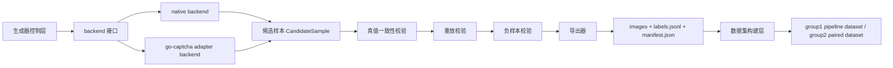

# 多模式验证码样本生成器设计

- 文档状态：草稿
- 当前阶段：DESIGN
- 最近更新：2026-04-02
- 目标读者：架构/开发、训练实施者、生成器实现者
- 负责人：Codex
- 上游输入：
  - `docs/04-project-development/03-requirements/prd.md`
  - `docs/04-project-development/04-design/technical-selection.md`
  - `docs/04-project-development/04-design/system-architecture.md`
  - `graphical_captcha_training_guide.md`
- 下游交付对象：
  - 生成器实现者
  - 数据导出/转换脚本实现者
  - 训练流水线维护者
- 关联需求：`REQ-002`、`REQ-004`、`REQ-005`、`REQ-006`、`REQ-007`、`REQ-008`

## 1. 方案结论

首版生成器固定采用“受控集成 + 可插拔 backend”方案：

1. 生成器控制层拥有训练契约、批次元数据和 `gold` 真值定义权。
2. backend 只负责提供验证码生成能力，不直接定义训练标签主事实源。
3. 首版同时支持两种模式：
   - 图形点选：`group1_multi_icon_match`
   - 滑块缺口定位：`group2_slider_gap_locate`
4. `go-captcha` 只作为 backend 候选，不作为训练标签事实源本身。
5. 任何无法证明真值正确性的样本一律不得进入训练集。

这里最关键的收口是：

- 不是“直接把第三方库产出的数据拿来训练”
- 而是“由自有控制层把第三方能力包进来，再统一导出受控训练契约”

## 2. 为什么要这样收口

训练场景真正需要的不是“验证码能生成出来”，而是“训练样本 100% 正确且可追溯”。

如果只直接接某个服务或库的公开接口，通常最多稳定拿到：

- 图片
- 某种校验答案
- 部分生成参数

但训练首版真正需要的是：

- 明确的 `captcha_type`
- 明确的 `mode`
- 明确的 `backend`
- 完整的目标几何真值
- 随机种子
- 素材版本
- 配置版本
- 批次标识
- 真值一致性校验结果
- 重放校验结果

所以本项目不接受“黑盒图片 + 事后猜标签”的路径。训练数据的来源控制权必须握在生成器控制层手里。

## 3. 支持的两种模式

### 3.1 第一专项：图形点选

- 目标：生成“查询图给出多个图标，场景图中按顺序点击对应目标”的样本
- 输出图片：
  - `query_image`
  - `scene_image`
- 输出真值：
  - `query_targets[].order`
  - `query_targets[].class`
  - `query_targets[].bbox`
  - `query_targets[].center`
  - `scene_targets[].order`
  - `scene_targets[].class`
  - `scene_targets[].bbox`
  - `scene_targets[].center`
  - `distractors[].class`
  - `distractors[].bbox`

### 3.2 第二专项：滑块缺口定位

- 目标：生成“给定主图和滑块图，定位缺口目标并输出偏移量”的样本
- 输出图片：
  - `master_image`
  - `tile_image`
- 输出真值：
  - `target_gap.bbox`
  - `target_gap.center`
  - `offset_x`
  - `offset_y`
  - `tile_bbox`

说明：

- 首版默认滑块任务以横向偏移为主，`offset_y` 应接近 0
- 但字段层面保留 `offset_y`，避免后续演进时重新改 schema

## 4. 总体架构



### 4.1 控制层职责

- 读取配置并选择 `mode`
- 选择 `backend`
- 固定批次 ID、随机种子、素材版本和配置版本
- 接收 backend 返回的候选样本对象
- 执行真值硬门禁
- 导出统一 JSONL 契约

### 4.2 backend 职责

- 根据输入模式生成候选图片和内部真值对象
- 返回候选样本，不直接写盘
- 不直接决定 `gold` 状态

### 4.3 导出层职责

- 只导出通过校验的样本
- 图片和 JSONL 同批次落盘
- 写入 `manifest.json`
- 记录 `mode`、`backend`、`seed`、素材版本和校验结果

## 5. backend 设计

### 5.1 接口原则

每个 backend 都必须返回统一的 `CandidateSample`，至少包含：

- `mode`
- `sample_id`
- `seed`
- `backend`
- `images`
- `truth`
- `materials`
- `config_snapshot`

控制层只接受这个统一对象，不直接依赖 backend 私有结构。

### 5.2 backend 候选

#### native backend

- 适用场景：
  - 完全自控的图形点选渲染
  - 完全自控的滑块缺口渲染
- 优势：
  - 标签控制最强
  - 与训练契约最一致
- 代价：
  - 需要自己实现更多图像生成细节

#### `go-captcha` adapter backend

- 适用场景：
  - 复用现成 click / slide 生成能力
  - 减少验证码行为本身的重复造轮子
- 优势：
  - 功能成熟
  - 覆盖图形点选和滑块两类模式
- 限制：
  - 只能通过 adapter 接入
  - 仍需要映射到自有 `CandidateSample`
  - 若无法稳定拿到训练所需真值，则不能成为 `gold` 数据源

#### `go-captcha-service`

- 结论：不作为首版训练生成主线
- 原因：
  - 服务接口天然偏运行时校验，不偏训练契约
  - 增加服务化复杂度
  - 更难保证批次重放和真值完整导出

## 6. `gold` 真值硬门禁

训练样本必须 100% 正确，这里不靠口头承诺，而靠硬门禁实现。

### 6.1 规则一：真值必须来自生成时内部对象

- `gold` 标签只允许来源于 backend 返回的内部真值对象
- 不允许从最终渲染图片反推出 `gold`
- 不允许从第三方服务公开返回值直接拼装 `gold`

### 6.2 规则二：同一份真值同时驱动渲染与答案导出

- 图形点选：
  - 查询图、场景图和 `targets/distractors` 必须来自同一份对象定义
- 滑块：
  - 主图、滑块图、缺口位置和偏移量必须来自同一份对象定义

只要渲染输入和标签输入不是同源对象，这条样本就不能算 `gold`。

### 6.3 规则三：每条样本必须支持重放

每条样本都必须记录：

- `backend`
- `mode`
- `seed`
- 素材版本
- 配置版本

同样的输入参数重新生成时，必须得到同样的内部真值。做不到这一点，就说明样本不可审计。

### 6.4 规则四：正向校验和负向校验都必须通过

- 正向校验：
  - 使用真值答案验证时，必须成功
- 负向校验：
  - 对答案施加少量错误偏移时，必须失败

对滑块模式尤其重要：

- 真值 `offset_x` 必须通过
- `offset_x +/- delta` 必须失败

### 6.5 规则五：失败样本不降级，不凑合

任何一条样本只要出现以下任一情况：

- 真值字段缺失
- bbox 越界
- 渲染结果与真值不一致
- 重放失败
- 负样本校验失败

就必须：

- 直接阻断
- 不写入 `raw`
- 不写入 `labels.jsonl`
- 不降级成 `gold`

必要时可以保留到调试目录，但不能进入正式训练链路。

## 7. 输出契约

### 7.1 图形点选 JSONL 示例

```json
{
  "sample_id": "g1_000001",
  "captcha_type": "group1_multi_icon_match",
  "mode": "click",
  "backend": "native",
  "query_image": "query/g1_000001.png",
  "scene_image": "scene/g1_000001.png",
  "targets": [
    {"order": 1, "class": "icon_house", "class_id": 0, "bbox": [20, 8, 42, 24], "center": [31, 16]},
    {"order": 2, "class": "icon_leaf", "class_id": 1, "bbox": [55, 10, 75, 26], "center": [65, 18]}
  ],
  "distractors": [
    {"class": "icon_boat", "class_id": 2, "bbox": [80, 12, 104, 28]}
  ],
  "label_source": "gold",
  "truth_checks": {
    "consistency": "passed",
    "replay": "passed",
    "negative_check": "passed"
  },
  "source_batch": "batch_0001",
  "seed": 202604020001
}
```

### 7.2 滑块定位 JSONL 示例

```json
{
  "sample_id": "g2_000001",
  "captcha_type": "group2_slider_gap_locate",
  "mode": "slide",
  "backend": "gocaptcha",
  "master_image": "master/g2_000001.png",
  "tile_image": "tile/g2_000001.png",
  "target_gap": {
    "bbox": [148, 56, 206, 114],
    "center": [177, 85]
  },
  "tile_bbox": [0, 56, 58, 114],
  "offset_x": 148,
  "offset_y": 0,
  "label_source": "gold",
  "truth_checks": {
    "consistency": "passed",
    "replay": "passed",
    "negative_check": "passed"
  },
  "source_batch": "batch_0001",
  "seed": 202604020101
}
```

## 8. 目录与命名约定

推荐批次输出目录：

```text
generator/output/
  group1/
    batch_0001/
      query/
      scene/
      labels.jsonl
      manifest.json
  group2/
    batch_0001/
      master/
      tile/
      labels.jsonl
      manifest.json
```

说明：

- 第一组和第二组分开落盘
- `labels.jsonl` 和图片同批次存放
- `manifest.json` 记录配置快照与校验摘要

## 9. CLI 设计

首版产品化生成器以 `sinan-generator` 作为正式入口，普通用户只接触工作区、素材同步和一步生成数据集：

```bash
sinan-generator workspace init --workspace D:\sinan-captcha-generator\workspace
sinan-generator materials import --workspace D:\sinan-captcha-generator\workspace --from D:\materials-pack
sinan-generator materials fetch --workspace D:\sinan-captcha-generator\workspace --source https://example.com/materials-pack.zip
sinan-generator make-dataset --workspace D:\sinan-captcha-generator\workspace --task group1 --dataset-dir D:\sinan-captcha-work\datasets\group1\firstpass
sinan-generator make-dataset --workspace D:\sinan-captcha-generator\workspace --task group2 --dataset-dir D:\sinan-captcha-work\datasets\group2\firstpass
```

## 10. 风险与应对

### 风险 1：第三方 backend 能生成图，但拿不到完整真值

- 应对：
  - 只允许通过 adapter 映射到统一对象
  - 映射不完整则不能标记为 `gold`

### 风险 2：滑块模式看起来简单，但偏移量与缺口框不一致

- 应对：
  - 强制记录 `target_gap.bbox`、`center` 和 `offset_x`
  - 对同一样本做正负验证

### 风险 3：后续又想把训练生成器直接改成线上服务

- 应对：
  - 保持控制层和 backend 解耦
  - 训练契约不依赖公网服务协议

### 风险 4：开发期为了赶进度放宽 `gold` 门禁

- 应对：
  - 把门禁写进导出规则和 QA 规则
  - 失败样本入库率必须为 0

## 11. 最终结论

这份设计的关键不是“选 native 还是 `go-captcha`”，而是先固定下面三件事：

1. 训练契约必须由自有控制层统一维护
2. 两种模式都必须走同一套 `gold` 硬门禁
3. backend 是可插拔能力源，不是训练事实源

只有这样，图形点选和滑块两类样本才能在后续长期演进中保持可训练、可追溯和可审计。
