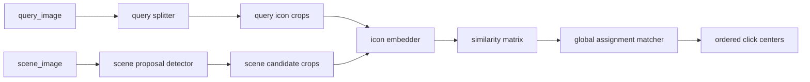

# `group1` 实例匹配重构设计

- 文档状态：草稿
- 当前阶段：DESIGN
- 最近更新：2026-04-11
- 目标读者：架构负责人、生成器实现者、训练链路实现者、自主训练维护者
- 负责人：Codex
- 上游输入：
  - `docs/04-project-development/03-requirements/prd.md`
  - `docs/04-project-development/03-requirements/requirements-analysis.md`
  - `docs/04-project-development/02-discovery/brainstorm-record.md`
- 关联需求：`REQ-003`、`REQ-005`、`REQ-006`、`REQ-008`、`REQ-014`、`NFR-001`、`NFR-010`

## 1. 设计结论

`group1` 正式路线从“闭集类名检测”切换为“实例匹配求解”。

正式链路固定为：

1. `query splitter`
2. `scene proposal detector`
3. `icon embedder`
4. `global assignment matcher`

对外业务合同保持不变：

- 输入：`query_image + scene_image`
- 输出：按 query 顺序排列的 scene 中心点序列

变化的是内部求解依据：

- 旧路线判断“是不是 `icon_flag`”
- 新路线判断“query 里的这个图标，在 scene 里是哪一个候选实例”

## 2. 为什么要重构

旧路线的根本问题不是“精度暂时不够”，而是正式合同和真实业务不一致：

- query 图片持续出现旧训练类表之外的新图标
- 人工审核和商业试卷长期被类名表绑住
- `class_id` 只能表达“同类”，不能表达“同一图标实例”
- 同类重复、相似图标和未知语义图标会持续放大歧义

因此，`group1` 的正式目标不应再是“稳定维护一个闭集类表”，而应是“稳定完成 query 到 scene 的实例对应”。

## 3. 目标架构



各组件职责：

- `query splitter`
  - 从 query 图切出 1 到多个 query item
  - 首版优先规则切分，不强制单独训练模型
- `scene proposal detector`
  - 只做类无关图标候选检测
  - 输出尽可能高召回的候选框
- `icon embedder`
  - 给 query item 和 scene candidate 生成统一向量
  - 学会把“同一个素材实例/模板”拉近，把 hard negative 拉远
- `matcher`
  - 计算相似度
  - 进行全局分配
  - 根据阈值和 margin 决定接受、拒判或歧义

## 4. 生成器重构

### 4.1 素材库组织

`group1` 素材库正式切换为“模板目录 + 变体文件”结构，不再兼容旧的 `group1.classes.yaml + group1/icons/<class_name>/`。

正式素材身份：

- `template_id`
- `variant_id`
- `asset_id = asset_<template_id>__<variant_id>`

正式目录结构：

```text
materials-pack-v3/
  backgrounds/
  group1/
    icons/
      tpl_flag/
        var_real_cluster_004_01.png
        var_tabler_outline.png
      tpl_house/
        var_real_cluster_040_01.png
        var_lucide_outline.png
  group2/
    shapes/
  manifests/
    materials.yaml
    group1.templates.yaml
    group2.shapes.yaml
```

规则：

- `group1/icons/` 下一级目录必须是 `template_id`
- `template_id` 格式固定为 `tpl_<snake_case>`
- 目录内每个 PNG 文件名必须直接等于 `variant_id`
- `variant_id` 格式固定为 `var_<snake_case>`
- `group1` 素材只接受透明底 PNG
- 不再保留按 `class_id / class_name` 组织和导入素材的兼容逻辑

辅助治理字段：

- `zh_name`
- `family`
- `tags`
- `source`
- `source_ref`
- `style`
- `status`

`group1.templates.yaml` 结构示例：

```yaml
schema_version: 3
task: group1
mode: instance_matching

templates:
  - template_id: tpl_flag
    zh_name: 旗帜
    family: symbol
    tags: [flag, banner]
    status: active
    variants:
      - variant_id: var_real_cluster_004_01
        source: real_query
        source_ref: cluster_004_01
        style: captured
      - variant_id: var_tabler_outline
        source: tabler
        source_ref: flag
        style: outline
```

### 4.2 `group1` 新 gold 契约

`group1` 真值至少要表达：

- query 项顺序
- scene 答案位置
- 对应素材身份

示例：

```json
{
  "sample_id": "g1_000001",
  "query_image": "query/g1_000001.png",
  "scene_image": "scene/g1_000001.jpg",
  "query_items": [
    {
      "order": 1,
      "bbox": [12, 8, 44, 40],
      "center": [28, 24],
      "asset_id": "asset_0182",
      "template_id": "tpl_0041",
      "variant_id": "var_0003"
    }
  ],
  "scene_targets": [
    {
      "order": 1,
      "bbox": [481, 212, 523, 254],
      "center": [502, 233],
      "asset_id": "asset_0182",
      "template_id": "tpl_0041",
      "variant_id": "var_0003"
    }
  ],
  "distractors": []
}
```

### 4.3 新数据集输出

生成器正式输出：

```text
group1/
  dataset.json
  proposal-yolo/
    dataset.yaml
    images/
    labels/
  embedding/
    queries/
    candidates/
    pairs.jsonl
    triplets.jsonl
  eval/
    labels.jsonl
  splits/
    train.jsonl
    val.jsonl
    test.jsonl
```

含义：

- `proposal-yolo/`
  - scene 里所有图标统一标成 `icon_object`
- `embedding/`
  - 为 metric learning 提供正负样本
- `eval/labels.jsonl`
  - 保留完整 query/scene/order 真值，专门用于整链路验收

### 4.4 切换原则

- 生成器正式代码只接受 `schema_version: 3` 的新素材包
- `group1.classes.yaml`、`group1/icons/<class_name>/` 和任何旧 `class_id` 素材导入逻辑必须删除
- 用户补素材时只需要维护：
  - `group1/icons/<template_id>/<variant_id>.png`
  - `manifests/group1.templates.yaml`
- `asset_id` 由导入器或读取层按 `template_id + variant_id` 规则生成，不再由人工维护独立目录

## 5. 商业试卷与人工审核重构

### 5.1 标注目标

商业试卷只表达业务真相：

- query 里第几个图标
- scene 里对应哪个答案框

不再让人工审核承担“先猜这到底属于哪个类名”的负担。

### 5.2 新标注规则

- `query`
  - 统一标成 `query_item`
  - 导出时按从左到右恢复顺序
- `scene`
  - 只标真正答案
  - 标签写 `01`、`02`、`03`
  - 不再要求 `01|icon_flag`

### 5.3 商业试卷导出合同

`reviewed/labels.jsonl` 至少保留：

- `query_items[{order,bbox,center}]`
- `scene_targets[{order,bbox,center}]`

可选保留：

- `class_guess`
- `review_note`
- `material_family`

但这些字段不再参与正式判卷。

## 6. 预标注策略

### 6.1 正式预标注主线

正式预标注仍以任务模型为主：

- proposal detector 出框
- query splitter 切 query
- embedder + matcher 给推荐对应
- 人工复核定稿

### 6.2 本地大模型的角色

本地多模态模型可以作为辅助工具，但不是正式真值源。

适合做：

- 判断 query 里大概有几个图标
- 给未知图标提供语义猜测
- 帮助发现新素材类别

不适合直接作为：

- 最终 bbox 真值来源
- 商业试卷正式答案生成器

## 7. 自动学习重构

`group1` 自主训练从旧的单链路 `TRAIN -> TEST -> EVALUATE`，重构为：

1. `PLAN`
2. `BUILD_DATASET`
3. `TRAIN_PROPOSAL`
4. `TRAIN_EMBEDDER`
5. `CALIBRATE_MATCHER`
6. `OFFLINE_EVAL`
7. `ERROR_MINING`
8. `JUDGE`
9. `BUSINESS_EVAL`
10. `EXPORT`

失败归因必须至少区分：

- `query_split_error`
- `proposal_miss`
- `proposal_overflow`
- `embedding_confusion`
- `assignment_error`
- `ambiguity_reject`

## 8. 晋级与商业测试口径

### 8.1 组件健康门

- `query_split_recall >= 0.995`
- `scene_target_proposal_recall >= 0.995`
- `embedding_recall_at_1 >= 0.97`
- `embedding_recall_at_3 >= 0.995`

### 8.2 离线晋级门

- `full_sequence_hit_rate >= 0.93`
- `single_target_hit_rate >= 0.985`
- `mean_center_error_px <= 6`
- `ambiguity_reject_rate <= 0.03`

### 8.3 商业测试成功门

- reviewed 试卷池不少于 `100` 题，推荐 `200`
- `business_success_rate >= 0.95`
- `hard_subset_success_rate >= 0.90`
- 每题必须同时满足：
  - 顺序完全正确
  - 点击数完全正确
  - 每个点击点都在容差内
  - 无 `missing / extra / ambiguous / timeout`

## 9. 环境要求

训练机必需环境：

- Windows + NVIDIA GPU
- Python 3.12
- `uv`
- PyTorch CUDA
- ONNX / ONNX Runtime 导出验证环境

按职责补充：

- 生成器或素材构建侧需要 Go
- 最终 solver 打包侧需要 Rust
- 人工审核需要 `X-AnyLabeling`
- 辅助预标注和素材审计可选 `Ollama + 本地多模态模型`

## 10. 交付形态

对调用方，最终仍然应表现为一个统一 solver：

- 输入 `query_image + scene_image`
- 输出有序点击点

但内部第一版不强制合并成一个单体模型。

正式导出资产预期为：

- `group1_proposal_detector.onnx`
- `group1_icon_embedder.onnx`
- `group1_matcher_config.json`

由统一 runtime 负责编排。

## 11. Cutover 与旧方案删除

本次重构不接受长期双轨并存。

正式 cutover 后必须删除：

- 旧 `query parser` 正式训练入口
- 旧 `scene detector + ordered_class_match_v1` 正式推理主线
- 旧 `NN|class` 商业试卷正式标注规则
- 旧 `class_id` 驱动的 `group1` 正式评估和晋级逻辑
- 仅服务旧方案的正式 CLI、测试和用户文档

允许短暂保留的只有：

- 数据迁移脚本
- 一次性转换脚本

它们不能继续作为正式主线的一部分存活。
