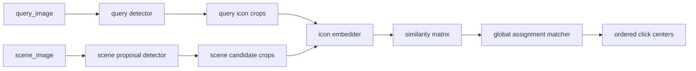

# `group1` 实例匹配工程化方案

- 文档状态：草稿
- 当前阶段：DESIGN
- 最近更新：2026-04-13
- 目标读者：架构负责人、生成器实现者、训练链路实现者、自主训练维护者
- 负责人：Codex
- 上游输入：
  - `docs/04-project-development/03-requirements/prd.md`
  - `docs/04-project-development/03-requirements/requirements-analysis.md`
  - `docs/04-project-development/02-discovery/brainstorm-record.md`
- 关联需求：`REQ-003`、`REQ-005`、`REQ-006`、`REQ-008`、`REQ-014`、`REQ-017`、`NFR-001`、`NFR-010`

## 1. 设计结论

`group1` 正式路线从“闭集类名检测”切换为“实例匹配求解”后，当前工程化目标基线进一步固定为：

1. `query detector`
2. `scene proposal detector`
3. `icon embedder`
4. `global assignment matcher`

对外业务合同保持不变：

- 输入：`query_image + scene_image`
- 输出：按 query 顺序排列的 scene 点击中心点序列

当前设计判断：

- `group1` 不能再把 query 侧当成纯规则切图问题。
- `group1` 也不应在现阶段直接跳到 query-conditioned one-shot detector 主线。
- 第一版正式工程化方案采用“两个 detector + 一个 embedder + 一个 matcher”的可解释流水线。

当前实现状态说明：

- 2026-04-12 代码主线仍处于“规则式 query splitter 过渡态”。
- 本文档定义的是后续正式收口目标，不等同于当前代码已经完成的实现状态。

## 2. 为什么这样设计

旧路线的根本问题不是“精度暂时不够”，而是正式合同和真实业务不一致：

- query 图片持续出现旧训练类表之外的新图标。
- `class_id` 只能表达“同类”，不能表达“同一图标实例”。
- 相似图标、重复图标和未知语义图标会持续放大歧义。

当前两类备选路线中：

- `query detector + scene detector + embedder + matcher`
  - 更容易做工程化 gate
  - 更容易定位失败原因
  - 更贴合当前生成器和训练仓库状态
- `query-conditioned one-shot detector`
  - 上限可能更高
  - 但训练组织、评估、导出和自动训练改造成本更高

因此首版正式工程化方案优先落到可解释流水线，而不是直接赌更重的一体化路线。

## 3. 目标架构



各组件职责：

- `query detector`
  - 只解决 query 图里的 3 个图标框选问题
  - 输出有序或可恢复顺序的 query item bbox
- `scene proposal detector`
  - 只做类无关图标候选检测
  - 目标是尽可能高召回 scene 中全部候选框
- `icon embedder`
  - 对 query item crop 和 scene candidate crop 编码
  - 学会把同一实例或同一模板拉近，把 hard negative 拉远
- `matcher`
  - 计算 `3 x N` 相似度矩阵
  - 做一一分配、阈值过滤和歧义拒判

## 4. 数据与生成器要求

### 4.1 `group1` gold 主事实源

`group1` 真值至少要表达：

- `query_image`
- `scene_image`
- `query_items`
- `scene_targets`
- `distractors`
- `asset_id / template_id / variant_id`

示例：

```json
{
  "sample_id": "g1_000001",
  "query_image": "query/g1_000001.png",
  "scene_image": "scene/g1_000001.jpg",
  "query_items": [
    {
      "order": 1,
      "bbox": [12, 8, 44, 40],
      "center": [28, 24],
      "asset_id": "asset_0182",
      "template_id": "tpl_0041",
      "variant_id": "var_0003"
    }
  ],
  "scene_targets": [
    {
      "order": 1,
      "bbox": [481, 212, 523, 254],
      "center": [502, 233],
      "asset_id": "asset_0182",
      "template_id": "tpl_0041",
      "variant_id": "var_0003"
    }
  ],
  "distractors": []
}
```

### 4.2 正式数据集派生产物

生成器正式输出应收口为：

```text
group1/
  dataset.json
  query-yolo/
    dataset.yaml
    images/
    labels/
  proposal-yolo/
    dataset.yaml
    images/
    labels/
  embedding/
    queries/
    candidates/
    pairs.jsonl
    triplets.jsonl
  eval/
    labels.jsonl
  splits/
    train.jsonl
    val.jsonl
    test.jsonl
```

含义：

- `query-yolo/`
  - query 图里的 3 个图标检测训练集
- `proposal-yolo/`
  - scene 图里的候选检测训练集
- `embedding/`
  - metric learning 的正负样本和 triplet 样本
- `eval/labels.jsonl`
  - 保留完整 query/scene/order 真值，用于整链路验收

### 4.3 样本规模基线

第一版工程化流程中，样本分 2 层：

- `dataset_smoke`
  - 规模：`200`
  - 用途：导出验证、训练链路联通验证、标签合同验证
- `dataset_v1`
  - 规模：建议 `10000`
  - 用途：第一版正式训练集

说明：

- 当前仓库 `group1.firstpass.yaml` 的 `sample_count = 200` 只能视为 smoke 规模。
- 不应把 `200` 条样本误认为正式训练集。
- `dataset_v1` 不承诺“一次就把全部模型训过门”，它的目标是提供第一轮严肃判断依据。

### 4.4 `embedder` 样本来源

`embedder` 的基础训练样本直接来自生成器真值：

- `anchor`
  - query 图中某个图标 crop
- `positive`
  - scene 图中与之对应的正确目标 crop
- `negative`
  - scene 中其他目标 crop
  - scene 中 distractor crop

正式要求：

- 仅靠“干净真值裁剪”还不够。
- 在 detector 初步过门后，必须新增 detector-aware `embedder` 样本构建阶段：
  - 使用 detector 预测框重新裁 crop
  - 引入 detector false positive 作为 hard negative
  - 生成第二版 `triplets`

## 5. 商业试卷与人工审核

### 5.1 标注目标

商业试卷只表达业务真相：

- query 里第几个图标
- scene 里对应哪个答案框

不再让人工审核承担“先猜类名”的负担。

### 5.2 新标注规则

- `query`
  - 统一标成 `query_item`
  - 导出时恢复 `order`
- `scene`
  - 只标真正答案
  - 标签写 `01`、`02`、`03`

### 5.3 商业测试边界

`reviewed/labels.jsonl` 是商业测试门禁答案，不回灌正式训练集。

## 6. 正式工程化工作流

### 6.1 总体原则

- 不做“三个模型无脑并行训练后直接集成”。
- 不做“一锅炖式端到端大模型统一反向传播”。
- 采用“分组件训练，整链路 gate，失败定向回退”的工程化流程。

### 6.2 阶段工作流

| 阶段 | 输入 | 主要输出 | 通过条件 | 失败后动作 |
| --- | --- | --- | --- | --- |
| `SMOKE_DATASET` | preset + 素材包 | `dataset_smoke` | 导出目录、标签字段、bbox 数量全部正确 | 修生成器/修导出器 |
| `DATASET_V1` | 通过 smoke 的生成器 | `dataset_v1` | `query-yolo/proposal-yolo/embedding/eval` 产物齐全 | 修素材/修 preset/修导出器 |
| `TRAIN_QUERY` | `query-yolo/` | `query detector best.pt`、`summary.json`、`failcases.jsonl` | query 检测过门 | 继续训练或补样本 |
| `QUERY_GATE` | query 训练结果 | `gate.json` | 达到 query gate | `CONTINUE_TRAIN` / `REBUILD_DATASET` / `FIX_EXPORTER` |
| `TRAIN_SCENE` | `proposal-yolo/` | `scene detector best.pt`、`summary.json`、`failcases.jsonl` | scene 检测过门 | 继续训练或补样本 |
| `SCENE_GATE` | scene 训练结果 | `gate.json` | 达到 scene gate | `CONTINUE_TRAIN` / `REBUILD_DATASET` / `FIX_EXPORTER` |
| `TRAIN_EMBEDDER_BASE` | `embedding/triplets.jsonl` | `embedder base best.pt`、`summary.json` | 基础检索指标过门 | 继续训练或补样本 |
| `BUILD_EMBEDDER_HARDSET` | query/scene detector 最佳权重 + `dataset_v1` | detector-aware `triplets` | 预测框裁剪和 hard negative 可用 | 若构建失败则修评估/构建器 |
| `TRAIN_EMBEDDER_HARD` | detector-aware `triplets` | `embedder final best.pt`、`summary.json` | detector-aware 检索指标过门 | 继续训练或补样本 |
| `CALIBRATE_MATCHER` | 3 个最佳模型 + `val/test` | `matcher config` | 阈值和 margin 稳定 | 继续调参 |
| `OFFLINE_EVAL` | 完整流水线 + `eval/labels.jsonl` | `offline_eval.json`、`error_buckets.json` | 离线整链路过门 | 回到对应组件或补样本 |
| `BUSINESS_EVAL` | 冻结试卷池 | `business_eval.json` | 商业测试成功门通过 | 回到对应组件或补样本 |
| `EXPORT` | 最佳组合 | solver bundle / ONNX 资产 / metadata | 导出验证通过 | 修导出链 |

### 6.3 串行执行要求

第一轮工程化落地必须按严格串行顺序执行：

1. `dataset_smoke`
2. `dataset_v1`
3. `TRAIN_QUERY`
4. `QUERY_GATE`
5. `TRAIN_SCENE`
6. `SCENE_GATE`
7. `TRAIN_EMBEDDER_BASE`
8. `BUILD_EMBEDDER_HARDSET`
9. `TRAIN_EMBEDDER_HARD`
10. `CALIBRATE_MATCHER`
11. `OFFLINE_EVAL`
12. `BUSINESS_EVAL`
13. `EXPORT`

说明：

- 第一轮不推荐把 3 个模型一开始就并行训练。
- 先串行可以更快定位工程瓶颈在数据、query、scene 还是 embedder。
- 等流程稳定后，再考虑把两个 detector 的训练做成资源层面的并行。

### 6.4 阶段结果枚举

每个阶段只允许产出有限结果，避免控制器自由发挥：

- `PASS`
  - 当前阶段达标，进入下一阶段
- `CONTINUE_TRAIN`
  - 当前数据集不变，继续训练
- `REBUILD_DATASET`
  - 当前是数据覆盖问题，需要生成 `dataset_v2`
- `FIX_EXPORTER`
  - 当前是生成器/导出器问题，先修链路
- `BACK_TO_QUERY`
  - 整链路失败归因到 query detector
- `BACK_TO_SCENE`
  - 整链路失败归因到 scene detector
- `BACK_TO_EMBEDDER`
  - 整链路失败归因到 embedder
- `TUNE_MATCHER`
  - 当前主要是 matcher 阈值问题，只调 matcher

### 6.5 何时重建数据集

只有命中下列情况时才进入 `dataset_v2`：

- 训练已明显收敛，但错误集中在某类样本分布
- 商业测试失败桶显示存在明显未覆盖场景
- hard negative 不足，且仅靠现有样本继续训练已无提升

如果只是：

- loss 仍在下降
- 指标仍在缓慢提升
- 当前失败不是结构性分布缺口

则不重建数据集，继续训练当前版本。

## 7. 晋级门定义

### 7.1 组件健康门

- `query_detector_recall >= 0.995`
- `query_exact_count_rate >= 0.995`
- `scene_target_proposal_recall >= 0.995`
- `embedding_recall_at_1 >= 0.97`
- `embedding_recall_at_3 >= 0.995`

说明：

- `query_exact_count_rate` 指 query detector 对一题稳定输出正好 3 个目标的比例。
- `scene_target_proposal_recall` 以“真正答案是否进入候选集”为主，不要求 scene detector 自己直接完成最终排序。

### 7.2 离线晋级门

- `full_sequence_hit_rate >= 0.93`
- `single_target_hit_rate >= 0.985`
- `mean_center_error_px <= 6`
- `ambiguity_reject_rate <= 0.03`

### 7.3 商业测试成功门

- reviewed 试卷池不少于 `100` 题，推荐 `200`
- `business_success_rate >= 0.95`
- `hard_subset_success_rate >= 0.90`
- 每题必须同时满足：
  - 顺序完全正确
  - 点击数完全正确
  - 每个点击点都在容差内
  - 无 `missing / extra / ambiguous / timeout`

## 8. 失败归因口径

自动训练和人工复盘都必须至少区分：

- `query_error`
- `scene_miss`
- `scene_overflow`
- `embedding_confusion`
- `assignment_error`
- `ambiguity_reject`
- `data_coverage_gap`

禁止再用单一“整体精度不够”概括全部失败。

## 9. 交付形态

对调用方，最终仍然应表现为统一 solver：

- 输入 `query_image + scene_image`
- 输出有序点击点

正式导出资产预期为：

- `group1_query_detector.onnx`
- `group1_proposal_detector.onnx`
- `group1_icon_embedder.onnx`
- `group1_matcher_config.json`

由统一 runtime 负责编排，不要求调用方理解内部多个组件。

## 10. Cutover 与旧方案删除

本次重构不接受长期双轨并存。

正式 cutover 后必须删除或降级的旧正式方案包括：

- 规则式 `query splitter` 正式主线地位
- 旧 `query parser` 正式训练入口
- 旧 `scene detector + ordered_class_match_v1` 正式推理主线
- 旧 `NN|class` 商业试卷正式标注规则
- 旧 `class_id` 驱动的 `group1` 正式评估和晋级逻辑

允许短暂保留的只有：

- 数据迁移脚本
- 一次性转换脚本
- 临时人工排障工具

它们不能继续作为正式主线的一部分长期存活。
