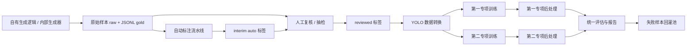

# 系统架构基线

- 项目名称：sinan-captcha
- 当前阶段：DESIGN
- 当前技术栈：Python, Ultralytics YOLO, Windows, CUDA, X-AnyLabeling/CVAT

## 架构结论

本项目的首版架构是“内部离线训练系统”，不是线上验证码服务。核心链路围绕训练数据闭环展开：

1. 生成器导出图片和标签
2. 自动标注与抽检
3. 数据转换与版本冻结
4. 两个专项模型分别训练
5. 统一评估与失败样本回灌

## 架构图

## 主要组成

### 1. 内部生成器层

- 作用：生成或导出训练样本
- 首选来源：现有自有验证码生成逻辑
- 备选来源：内部部署的 `go-captcha` 底座

### 2. 数据层

- `raw`：原始图片与真值
- `interim`：自动预标注结果
- `reviewed`：抽检通过数据
- `yolo`：训练派生产物
- `reports`：统计和质检报告

### 3. 算法层

- 第一专项：多类别检测
- 第二专项：单类别检测
- 第二组规则法：预标注和对照，不是最终主交付

### 4. 评估层

- 第一专项指标：
  - 单目标点命中率
  - 整组顺序全部命中率
  - 平均点误差
  - 错序率
- 第二专项指标：
  - 点命中率
  - 平均点误差
  - IoU
  - 推理时间

## 数据流说明

### 第一组

1. 生成器输出查询图、场景图、目标顺序、目标框、干扰项框
2. 优先得到 `gold` 标签
3. 如果没有 `gold`，先做种子集，再生成 `auto`
4. 转换为多类别 YOLO 检测数据
5. 训练多类别检测模型
6. 用查询顺序将检测结果映射成点击点

### 第二组

1. 生成器输出查询图、场景图、目标框、中心点
2. 若无 `gold`，先走规则法预标注
3. 抽检后形成 `reviewed`
4. 转换为单类别 YOLO 检测数据
5. 训练单类别检测模型
6. 输出目标框与中心点

## 为什么不先做线上服务

- 当前目标是训练闭环，不是业务接入
- 先做线上服务会放大部署、鉴权、接口和运维复杂度
- 训练阶段需要的是“高质量标签”，而不是“对外稳定 SLA”

## 主要风险

- 生成端无法直接导出坐标
- 第一组类别表不稳定
- 第二组目标语义扩张
- Windows GPU 环境兼容问题
- 自动标注污染训练集

## 架构守则

- 内部生成器与训练流水线解耦
- 两专项模型独立训练与独立验收
- JSONL 是标签主事实源
- 测试集冻结，不随训练批次频繁变化
