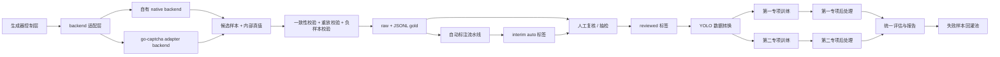

# 系统架构基线

- 项目名称：sinan-captcha
- 当前阶段：DESIGN
- 当前技术栈：Python, Ultralytics YOLO, Windows, CUDA, X-AnyLabeling/CVAT

## 架构结论

本项目的首版架构是“内部离线训练系统”，不是线上验证码服务。生成器按“受控集成 + 可插拔 backend”实现，核心链路围绕训练数据闭环展开：

1. 生成器控制层选择模式与 backend
2. backend 生成候选样本和内部真值
3. 真值一致性校验与重放校验阻断坏样本
4. 合格样本以 `raw + JSONL gold` 形式落盘
5. 自动标注、抽检、转换、训练、评估继续复用现有训练主线

## 架构图

## 主要组成

### 1. 生成器控制层

- 作用：统一模式选择、batch 管理、真值导出和阻断规则
- 控制模式：
  - 第一专项：图形点选
  - 第二专项：滑块缺口定位
- backend 候选：
  - 自有 native backend
  - `go-captcha` 适配 backend

### 2. 数据层

- `raw`：仅保存通过真值校验的原始图片与 `gold`
- `interim`：自动预标注结果
- `reviewed`：抽检通过数据
- `yolo`：训练派生产物
- `reports`：统计和质检报告

### 3. 算法层

- 第一专项：多类别检测
- 第二专项：滑块缺口定位
- 第二组规则法：预标注和对照，不是最终主交付

### 4. 评估层

- 第一专项指标：
  - 单目标点命中率
  - 整组顺序全部命中率
  - 平均点误差
  - 错序率
- 第二专项指标：
  - 点命中率
  - 平均点误差
  - IoU
  - 偏移误差
  - 推理时间

## 数据流说明

### 第一组

1. 生成器输出查询图、场景图、目标顺序、目标框、干扰项框
2. 同一份内部真值同时驱动渲染和标签导出
3. 通过一致性校验后写入 `gold`
4. 转换为多类别 YOLO 检测数据
5. 训练多类别检测模型
6. 用查询顺序将检测结果映射成点击点

### 第二组

1. 生成器输出主图、滑块图、缺口目标框、中心点和偏移量
2. 同一份内部真值同时驱动渲染和标签导出
3. 通过一致性校验后写入 `gold`
4. 转换为滑块定位训练数据
5. 训练滑块缺口定位模型
6. 输出目标框、中心点和偏移量

## 为什么不先做线上服务

- 当前目标是训练闭环，不是业务接入
- 先做线上服务会放大部署、鉴权、接口和运维复杂度
- 训练阶段需要的是“高质量标签”，而不是“对外稳定 SLA”

## 主要风险

- backend 无法稳定提供训练所需真值
- 第一组类别表不稳定
- 第二组滑块语义扩张为多缺口或轨迹任务
- Windows GPU 环境兼容问题
- 自动标注污染训练集

## 架构守则

- 生成器控制层拥有训练契约与 gold 真值定义权
- backend 只能提供生成能力，不能反向定义 JSONL 主事实源
- 两专项模型独立训练与独立验收
- JSONL 是标签主事实源
- 测试集冻结，不随训练批次频繁变化
