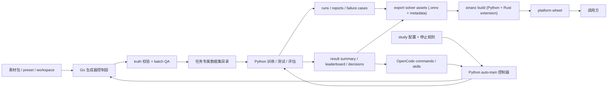

# 系统架构基线

- 项目名称：sinan-captcha
- 当前阶段：IMPLEMENTATION（设计基线维护）
- 当前技术栈：Python, PyTorch, Ultralytics YOLO, ONNX, ONNX Runtime, Rust, Windows, CUDA, X-AnyLabeling/CVAT, OpenCode, Optuna

## 架构结论

本项目首版架构应被理解为：

- 一个本地统一验证码求解产品面
- 加上一套为它持续生产模型的本地模型生产系统

也就是说，架构主线不再是“离线训练系统本身”，而是：

1. 右侧最终交付：
   - solver wheel
   - embedded ONNX assets
   - Rust native extension
   - 单一业务合同
2. 左侧生产平面：
   - 生成器
   - 数据治理
   - 训练 / 测试 / 评估
   - 自主训练控制平面

## 架构图

## 架构分层

### 1. 交付面

- `sinanz` platform wheel
- embedded ONNX assets
- Rust native extension
- 单一函数调用合同

这一层的目标是让调用方只看到：

- `sn_match_targets(...)` 的有序中心点序列
- `sn_match_slider(...)` 的目标中心点

而不是看到训练目录、模型训练名、子模型路径或 study 账本。

### 2. 生产面

- Go 生成器控制层
- 数据契约与版本治理
- 标注复核与训练数据转换
- `group1` / `group2` 训练模块
- 推理后处理与评估
- 自主训练控制平面

这一层负责不断生产更好的导出资产与 wheel，但不直接对调用方暴露内部复杂度。

### 3. 资产面

- `materials/`
- `datasets/`
- `runs/`
- `reports/`
- `studies/`
- `bundles/`
- `dist/solver-assets/`

这一层的规则是：

- 训练资产与交付资产分开
- 交付资产不能依赖训练资产的绝对路径

## 主要组成

### 1. 统一求解层

- Python API 负责参数归一化、图片解码和异常语义
- Rust 扩展负责 ONNX Runtime provider 选择、会话建立和推理桥接
- `group1` 执行：
  - `query splitter -> scene proposal detector ONNX -> icon embedder ONNX -> matcher`
- `group2` 执行：
  - `slider gap locator ONNX`
- 统一输出：
  - 业务结果对象
  - 可选调试信息

### 2. 导出资产与发布层

- 负责把 `group1` proposal detector、embedder、matcher 配置和 `group2` 模型导出为 ONNX + metadata
- 负责导出资产校验、相对路径解析和 wheel 组装
- 负责把训练运行产物变成可复制、可部署、可回滚的交付实体

### 3. 生成器控制层

- 统一模式选择、批次管理、真值导出和阻断规则
- 控制 workspace preset、素材索引和 truth-preserving 视觉增强
- backend 只提供生成能力，不得定义训练事实

### 4. 数据治理层

- 维护 `gold / auto / reviewed` 状态流转
- 冻结 train / val / test 切分
- 维护 `group1` 实例匹配数据契约与 `group2` paired dataset 契约
- 维护失败样本回灌和版本追加

### 5. 训练与评估层

- `group1`：
  - 训练 `scene proposal detector`
  - 训练 `icon embedder`
  - 校准 `matcher`
  - 经整链路验证形成任务结果
- `group2`：
  - 训练 paired locator
  - 输出中心点、目标框和可选偏移量
- 评估层统一生成任务级指标和失败样本清单

### 6. 自主训练控制平面

- Python 控制器维护 study 生命周期
- OpenCode commands / skills 负责受限解读和结构化判断
- `Optuna` 只在允许范围内承担参数搜索
- 任何 agent 失效都必须回退到规则模式

## 任务数据流

### `group1`

1. 生成器输出查询图、场景图、目标顺序、实例身份和 `gold`
2. 数据层导出 `dataset.json + proposal-yolo/ + embedding/ + eval/ + splits`
3. 训练 `scene proposal detector`、`icon embedder`，并校准 `matcher`
4. Rust 扩展加载 ONNX 模型和 matcher 配置，统一求解层调用实例匹配链
5. 输出有序中心点序列

### `group2`

1. 生成器输出主图、缺口图、目标框和中心点真值
2. 数据层导出 `dataset.json + master/tile/splits`
3. 训练 paired locator
4. Rust 扩展执行 ONNX 推理并返回中心点主结果
5. 如调用方提供附加定位上下文，再返回偏移量等辅助字段

## 当前实现对齐状态

### 已对齐部分

- 生成器控制层和数据导出主链路已存在
- 训练 / 测试 / 评估主链路已存在
- 自主训练控制器与 study 账本已存在
- `core/solve` 与统一求解合同骨架已存在

### 当前仍需继续提升的部分

- `sinanz` 当前仍是 Python 子项目骨架，尚未切到正式平台 wheel
- `auto-train` 目前已经能把 `dataset_plan` 中的 `preset`、`sample_count`、`sampling` 和 `effects.*` 下发到生成器，但还没有进入素材选择、类目定向采样和更细粒度的数据策略
- solver 运行时当前仍处在 Python/PyTorch 过渡态，尚未完成 ONNX + Rust 迁移
- `group1` 当前代码实现仍停留在旧闭集类名流水线，尚未切到正式实例匹配主线

## 为什么不先做公网服务

- 当前最需要稳定的是 solver 交付物和训练事实源，不是公网 SLA
- 如果过早转向公网服务，会把部署、鉴权、接口治理复杂度提前放大
- 本地统一求解入口已经足以表达最终业务语义，并为未来 HTTP 映射保留空间

## 架构守则

- 统一求解层不得绕过导出资产直接从 `runs/` 目录取模型
- 生成器控制层拥有 `gold` 真值定义权
- backend 只能提供生成能力，不能反向定义训练契约
- 两专项模型独立训练、独立验收、统一交付
- AI 判断只消费摘要工件，不把聊天上下文当唯一事实源
